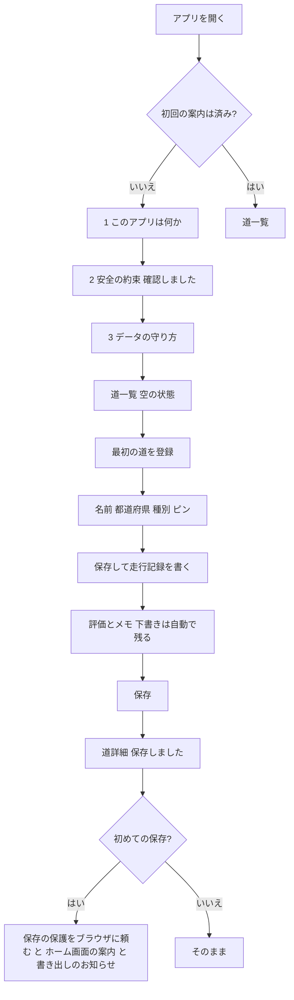

# 公道レビュー（road-review）PRD v2（方針転換版・案）

- ステータス: **案（CEO の確認待ち）**。CEO 決定（2026-10-08）6点を反映した書き直し
- 作成: feature-planner（CPO 配下）。CPO のレビュー前
- 作成日: 2026-10-08
- 元にした文書:
  - `road-review-prd.md`（v1.1。以下「v1」）
  - `road-review-ux.md`（画面と操作の流れ。以下「UX v1」）
  - `docs/org/research/04-product-ux-quality.md`（品質の批評。以下「批評04」）
  - `docs/org/org-handbook-v2.md`（組織ハンドブック。Gate 1＝価値の確認。以下「ハンドブック」）
- **ストーリー番号はこの文書が唯一の正**（批評04 U-3 の対策）。v1 の番号との対応は付録Aにある
- 表記: 【事実】出典で確かめた／【推論】根拠から考えた／【未確認】確かめていない（確かめ方を書く）

用語メモ（この文書で使う言葉）:
- **端末内保存**（スマホやパソコンのブラウザの中だけにデータを置くこと。サーバーには送らない）
- **書き出し / 読み込み**（データを1つのファイル＝JSON にして保存する / そのファイルからデータを戻す）
- **下書きの自動保存**（入力の途中の内容を、保存ボタンを押す前から端末内に残しておくこと）
- **ホーム画面に追加**（iPhone の Safari で「共有」→「ホーム画面に追加」を選び、アプリのように開けるようにすること）
- **タップ領域**（指で押して反応する範囲）

---

## 0. CEO 決定（2026-10-08）と、この版で変わること

| # | CEO 決定 | この PRD での扱い |
|---|---|---|
| D1 | ログイン・認証は一切なし。だれでも使える | ログイン画面・認証の処理をすべて削除（9章） |
| D2 | データは利用者の端末（ブラウザ）の中だけに保存。サーバーの DB なし。Supabase は削除 | 端末内保存に切り替え（7章）。サーバーにデータを送らない |
| D3 | 最初から JSON の書き出し・読み込みを入れる（iOS Safari の保存データの自動削除と、機種変更への備え） | US-14〜US-17 を Must にする |
| D4 | 写真なし | 写真の機能・ストレージをすべて削除 |
| D5 | ホスティング（公開する場所）は Vercel のまま | 変更なし。ただし Vercel はアプリの画面を配るだけで、記録は受け取らない |
| D6 | UI はシンプル・カラフル・初めての人がすぐ分かる・**スマホが最優先** | 12章のスマホの受入条件を、すべての画面の完了条件にする |

**変えないもの（中心の価値）**: 走った道（峠 / スカイライン / 海岸線 / 林道 / その他）を集める。走行ごとに多軸で評価する。道の情報を確認日つきで残す。集めた数を眺める。地図で場所を見る。**速度・時刻・タイム・ランキングは、ずっと扱わない。** 運転中に操作させない。

---

## 1. 価値仮説シート（Gate 1。1枚）

ハンドブック 5.2 の形。【仮説】と【事実】を分けて書く。空欄（`[　]`）は CEO が決める。

| 欄 | 中身 |
|---|---|
| **用事（1つ）** | 【仮説・要インタビューで確定】「走った道を集めて、あとで見返して楽しみ、次に行く道を決めるときの手がかりにしたい」。批評04 V-1 のとおり、用事が「振り返り」と「計画」のどちらが主かは未確定。**15分インタビューの後に、どちらか1つに絞って書き直す** |
| **誰の** | 【事実】最初の利用者は Hiro 本人（P0）。【仮説】その後、同じ趣味のライダー・ドライバー（P1〜P3） |
| **成功の指標（1つ）** | 「判断日までに、記録を**見返した**回数 M 回」（記録した件数ではなく、使って役に立った回数を見る。批評04 V-5） |
| **入力の指標** | 走行記録の件数 N 件／「次の行き先を決めるのに使った」回数 K 回 |
| **一番危ない仮説** | 【仮説】「Hiro は月に数回以上ドライブ・ツーリングに出ていて、記録を続けられる」。頻度は【未確認】（ハンドブック U-13） |
| **確かめ方** | 2章のドッグフーディング（自分で使ってみる）計画 |
| **やめる条件** | 判断日に M が `[　]` 回未満、かつ N が `[　]` 件未満なら、CEO が「直す」か「やめる」を決める |
| **判断日** | `[YYYY-MM-DD]`（CEO のカレンダーに入れる） |

### 1.1 課題（v1 から引き継ぎ、言い方を短くした）

- 走った道の記憶が写真フォルダ・SNS・メモに散らばり、「あの峠はどうだったか」を後から見返しにくい。
- 冬季閉鎖・料金・二輪通行止め・トイレの有無など、次の計画に役立つ情報が手元に残らない。
- 【事実】Google マップの移動履歴（タイムライン）はウェブ版が終わり、端末の中だけの保存になった（v1 2章、CSO 市場分析 4章）。

### 1.2 v2 で新しく入れる価値の仮説

- 【仮説】**登録なしですぐ使える**ことで、「試しに1本記録する」までの手間がなくなる。
- 【仮説】**データが自分の端末だけにある**ことは、位置（よく行く場所）を他人に預けたくない人にとって安心になる。
- 【推論】その代わり、「端末を変えた・ブラウザのデータが消えた」ときに全部失う危険がある。だから書き出し（バックアップ）を最初から「本体の機能」として扱う（D3）。

---

## 2. Gate 1 成果物: ドッグフーディング計画（CEO 用・短い版）

**ゴール**: 「このアプリは Hiro の役に立つか」を、件数ではなく“使った場面”で判断できるようにする。
→ **そのために** 期間を区切って実際に使い、決めた数字と比べる。
→ **さらにそのために** 始める前に数字を CEO が決め、測り方をアプリの中に用意しておく（新しい外部サービスは使わない）。

### 2.1 始める前（合計 約20分）

| 順 | やること | 担当 | 時間 |
|---|---|---|---|
| 1 | 15分インタビュー（質問は下の3つだけ。誘導しない） | user-researcher（旧 ux-researcher）が質問、CEO が答える | 15分 |
| 2 | 下の表の `[　]` を CEO が埋める | CEO | 5分 |
| 3 | 判断日をカレンダーに入れる | CEO | 1分 |

インタビューの質問（ハンドブック 5.2）:
1. 直近3回のドライブ・ツーリングで、行き先をどうやって決めましたか？
2. 走った後、何かを見返したことはありますか？それは何でしたか？
3. 最近、1か月に何回くらい走りに行きますか？

### 2.2 成功の基準（CEO が数字を決める）

| 指標 | 意味 | 目標 | 測り方 |
|---|---|---|---|
| N: 走行記録の件数 | 期間中に記録した数 | `[　]` 件以上 | アプリの「つかったきろく」画面（US-20）。端末内の件数 |
| M: 見返した回数 | 道の詳細を開いた回数。**記録を保存した直後の10分間は数えない**（記録の流れで開いた分を除くため） | `[　]` 回以上 | 同上（端末内に回数だけ残す） |
| K: 計画に使った回数 | 「次の行き先を決めるのにアプリを見た」回数 | `[　]` 回以上 | 走行記録フォームの任意の1問「今回、このアプリは何かの役に立ちましたか？」（US-20）＋週1回の CEO への3分の聞き取り |
| 代わり手段との比較 | Google マイマップ等で同じことをした1週間の記録 | 「代わり手段では足りない点」が具体的に1つ以上 | CEO のメモ（ハンドブック 5.2 の必須成果物。省くかは CEO が決める） |
| 困ったこと | 使っていて困った・迷った場面 | 件数の目標なし。すべて記録する | 週1回の聞き取り |

- 期間: `[　]` 週間（`[開始日]` 〜 `[判断日]`）
- 【推論】ドライブが月1回なら、4週間で集まる材料は1〜2件しかない（批評04 6.4）。頻度がインタビューで分かってから期間を決めるのが安全。

### 2.3 判断日にやること

1. CEO が「つかったきろく」画面の数字を、書き出したファイルか画面の写真で CPO に渡す（サーバーには数字が無いので、これが唯一の材料）。
2. CPO が 2.2 の表に実測値を記入する。
3. CEO が「続ける・直す・やめる」を決め、`docs/product/` に記録する（ハンドブック Gate 9）。

---

## 3. ペルソナ（※仮説・未検証）

| ID | ペルソナ（仮説） | 求めていること | v2 で特に効く点【推論】 |
|---|---|---|---|
| P0 | **Hiro 本人（最初の利用者）** | 自分で使って価値を確かめる | 2章の計画で評価する |
| P1 | ツーリングライダー（40〜50代・二輪） | 路面・冬季閉鎖・二輪通行止め・トイレを次回のために残す | 手袋を外して休憩所で片手入力 → 大きなボタン・片手操作・屋外での読みやすさ |
| P2 | 景色ドライブ派（30代・四輪） | 景観道路の情報、施設、冬季閉鎖 | 登録なしで試せる |
| P3 | 「全部走りたい」収集型 | 走った道の数・都道府県の数を眺める | コレクション画面 |

根拠の数字（新車バイク購入者の平均年齢など）は v1 3章と同じ（CSO 市場分析）。

**共通の前提**: ドライブ中には操作しない。帰宅後か、安全な場所に停車して休んでいるときに記録する。

---

## 4. スコープ

優先度は Must（v2 に必ず入れる）／Should（v2 に入れたい。遅れたら後ろへ回す）／Later（v2 の後）。

### 4.1 MVP v2

| # | 機能 | 優先度 | ストーリー |
|---|---|---|---|
| F1 | 初回の案内（3ステップ。安全の約束とデータの守り方を含む） | Must | US-01 |
| F2 | 道の登録・編集・削除 | Must | US-02, US-03, US-11 |
| F3 | 走行記録（総合＋景観/路面/走りやすさ＋交通量＋メモ）の登録・編集・削除 | Must | US-04, US-11 |
| F4 | 下書きの自動保存（再読み込み・閉じても消えない） | Must | US-05 |
| F5 | 道一覧（ホーム）と、名前検索・種別・都道府県の絞り込み・並び替え | Must | US-06, US-07 |
| F6 | 道詳細（集計・小さな地図・道の情報・走行記録） | Must | US-08, US-09 |
| F7 | 道の情報（通行ルール4・施設4、確認日つき、古い情報の警告） | Must | US-10 |
| F8 | 走った道のコレクション（本数・種別・都道府県 N/47） | Must | US-12 |
| F9 | 安全の表示（記録フォームの常時表示・林道の注意・フッター） | Must | US-13 |
| F10 | 書き出し（JSON） | Must | US-14 |
| F11 | 書き出しのお知らせ（リマインダー） | Must | US-15 |
| F12 | 読み込み（検査つき。合わせる / 置き換える を選ぶ） | Must | US-16 |
| F13 | 消えにくくする工夫（保存の保護をブラウザに頼む・iPhone のホーム画面案内） | Must | US-17 |
| F14 | 外部への送信の説明（地理院タイル） | Must | US-18 |
| F15 | 状態の表示（読み込み中・空・エラー・保存できない環境） | Must | US-19 |
| F16 | つかったきろく（Gate 1 の数字を端末内で数える） | Must | US-20 |
| F17 | 道一覧の地図表示（リストと切り替え） | Should | US-21 |
| F18 | 一度開いた端末なら、電波がなくてもアプリが開く | Should | US-22 |

### 4.2 Later（v2 の後）

| 項目 | メモ |
|---|---|
| 車両種別（四輪/二輪）・天候の入力 | フォームを短く保つため v2 では外す（D6）。2章の聞き取りで「欲しい」が出たら戻す |
| 「行きたい道」の印 | 批評04 V-6。用事が「計画」に決まったら優先度を上げる |
| 道の情報での絞り込み（冬季閉鎖なし・トイレあり など） | 用事が「計画」に決まったら |
| 制覇マップ（都道府県の塗り分け） | コレクション画面の使われ方を見て判断 |
| 端末どうしの同期（サーバーを使う） | D2 に反する。CEO の新しい決定が必要 |
| 公開共有 | v1 5章と同じ前提（コンテンツポリシー・通報・モデレーション）に加え、サーバーが必要 |
| GPX 取り込み・線で描く | v1 と同じ |
| CSV での書き出し | JSON で十分か、2章の聞き取りで判断 |

### 4.3 ずっと扱わないもの

速度・時刻・所要時間・区間タイム・傾き角・ランキング・集団走行の呼びかけ・リアルタイムの GPS 追跡・現在地への追従・「現在地へ移動」ボタン・位置情報の取得（Geolocation API の呼び出し）・写真（D4。v2 では扱わない）。

---

## 5. 画面一覧（URL の最終決定は CTO）

| 画面 | 主な内容 | タブ |
|---|---|---|
| S-01 初回の案内 | 3ステップ（US-01） | 出さない |
| S-02 道一覧（ホーム） | 検索・絞り込み・並び替え、カード一覧、Should で地図切り替え、書き出しのお知らせ | 表示（「道」） |
| S-03 道の登録・編集 | 名前・都道府県・種別・開始/終了ピン、削除（編集時） | 出さない |
| S-03a ピンのピッカー | 全画面の地図、中央の十字、「この位置にする」 | 出さない |
| S-04 道詳細 | 見出し、林道の注意、評価のまとめ、小さな地図、道の情報、走行記録 | 表示（「道」） |
| S-05 走行記録の登録・編集 | 安全バナー、走行日、評価、交通量、メモ、任意の1問、削除（編集時） | 出さない |
| S-06 道の情報の更新 | 確認日と8項目 | 出さない |
| S-06a 道の情報の履歴（シート） | 項目ごとの過去の記録と削除 | — |
| S-07 コレクション | 本数・種別・都道府県 | 表示（「コレクション」） |
| S-08 データ（設定） | 書き出し・読み込み・保存の状態・ホーム画面の案内・安全上の注意をもう一度読む・外部送信の説明・このアプリについて・全データ削除・つかったきろく | 表示（「データ」） |
| S-09 見つからない | 「この道は見つかりません」「道の一覧へ」 | 表示 |

- タブは画面の下に固定。「道 / コレクション / データ」の3つ。各タブは 44×44px 以上、文字ラベル付き、選択中は `aria-current="page"` と形でも示す。
- 入力フォームとピッカーではタブを隠す（入力中にタブを押して画面が変わるのを防ぐ。UX v1 2.1）。
- 画面の中央に大きく浮かぶ「＋」ボタンは作らない（UX v1 の方針「その場ですぐ記録する印象を避ける」を守る）。主な操作は画面下の固定バーに置く（12章 MB-4）。
- ログイン関係の画面（`/login`・`/login/sent`・`/login/error`・`/auth/callback`）は**すべて無くす**。

---

## 6. 操作の流れ（初めての人）



---

## 7. データの持ち方（考え方の段階。物理設計は CTO / code-architect）

### 7.1 方針

1. **データは端末内だけに置く。** 道・走行記録・道の情報・設定・下書き・つかったきろく、のどれもサーバーへ送らない。
2. **保存場所は IndexedDB を推奨**（ブラウザに入っている、量の多いデータを置ける仕組み）。【推論】localStorage（小さなデータ置き場）は1つのサイトあたり数 MB 程度で、まとめて書き込むと途中で失敗したときに半端な状態が残りやすい。最終決定は CTO。
3. **ID は端末で作る**（`crypto.randomUUID()` のような重なりにくい ID）。読み込みで「合わせる」ときに、同じ記録かどうかを ID で見分けるため。
4. **扱わないデータは項目として作らない**: 速度・時刻・所要時間・タイム・傾き角・順位（v1 7.1 と同じ）。
5. **形の版（スキーマ版）を持つ**: 保存データと書き出しファイルに `schemaVersion` を入れる。将来、形を変えたときに古いファイルも読めるようにするため。

### 7.2 エンティティ

**Road（道）**
| 項目 | 型（考え方） | 決まり |
|---|---|---|
| id | 文字列（UUID） | 必須・重複なし |
| name | 文字列 | 前後の空白を除いて1〜50文字 |
| prefectureCode | 整数 | 1〜47（JIS の都道府県コード） |
| roadType | 列挙 | `pass` 峠 / `skyline` スカイライン / `coastal` 海岸線 / `forest_road` 林道 / `other` その他。既定は `other` |
| start | {lat, lng} または null | **v2 では任意**（理由は 7.4）。緯度 -90〜90、経度 -180〜180 |
| end | {lat, lng} または null | 任意 |
| createdAt / updatedAt | 日時（ISO 8601） | 必須 |

**Drive（走行記録）**
| 項目 | 型 | 決まり |
|---|---|---|
| id | UUID | 必須 |
| roadId | UUID | 必須。存在する Road の id |
| drivenOn | 日付（YYYY-MM-DD） | 必須。**日付だけ、時刻は持たない**。日本時間の今日以前、2000-01-01 以降 |
| ratingOverall | 整数 | 必須。1〜5 |
| ratingScenery / ratingSurface / ratingEase | 整数または null | 任意。1〜5（景観 / 路面 / 走りやすさ） |
| trafficLevel | 列挙または null | `low` 少 / `normal` 普通 / `high` 多 |
| memo | 文字列 | 任意。2000文字以内 |
| helpfulNote | 文字列 | 任意。200文字以内。Gate 1 の1問の答え（US-20） |
| createdAt / updatedAt | 日時 | 必須 |

**RoadInfoObservation（道の情報の記録。上書きせず追記）**
| 項目 | 型 | 決まり |
|---|---|---|
| id | UUID | 必須 |
| roadId | UUID | 必須 |
| item | 列挙 | 通行ルール: `motorcycle_ban` 二輪通行止め / `night_closure` 夜間通行止め / `winter_closure` 冬季閉鎖 / `toll` 料金。施設: `parking` 駐車場 / `toilet` トイレ / `michi_no_eki` 道の駅 / `observatory` 展望台 |
| status | 列挙 | `yes` / `no` / `unknown` |
| memo | 文字列 | 任意。200文字以内 |
| confirmedOn | 日付 | 必須。日本時間の今日以前 |
| createdAt | 日時 | 必須 |

- 最新の値の決め方は v1 と同じ（同じ道・同じ項目で `confirmedOn` が一番新しいもの。同じ日なら `createdAt` が新しいもの）。

**Meta（この端末の設定。書き出しには一部だけ入れる）**
| 項目 | 意味 | 書き出しに入れるか |
|---|---|---|
| schemaVersion | 保存データの形の版 | 入れる |
| onboardingCompletedAt | 初回の案内を終えた日時 | 入れない（新しい端末でも案内を見せるため） |
| safetyAcknowledgedAt | 安全の約束で「確認しました」を押した日時 | 入れない（同上） |
| lastExportedAt | 最後に書き出した日時 | 入れない |
| changesSinceExport | 最後の書き出しの後に変わった件数 | 入れない |
| reminderSnoozedUntil | 書き出しのお知らせを「あとで」にした期限 | 入れない |
| persistRequestedAt / persistGranted | 保存の保護を頼んだ日時と結果 | 入れない |

**Draft（下書き）**: フォームごとに1つ。キーは `road:new`、`road:{roadId}`、`drive:new:{roadId}`、`drive:{driveId}`、`info:new:{roadId}`。中身は入力中の値と `savedAt`。**書き出しには入れない。**

**UsageLog（つかったきろく）**: `{ type: 'road_detail_opened' | 'drive_saved' | 'search_used', at }` の回数だけ。位置・道の名前は入れない。書き出しには入れる（任意。2章で CEO が数字を渡すため）。

### 7.3 書き出しファイルの形（JSON の約束）

```json
{
  "format": "road-review-export",
  "schemaVersion": 1,
  "exportedAt": "2026-10-08T21:30:00+09:00",
  "appVersion": "2.0.0",
  "counts": { "roads": 12, "drives": 30, "roadInfoObservations": 18 },
  "data": {
    "roads": [ /* Road */ ],
    "drives": [ /* Drive */ ],
    "roadInfoObservations": [ /* RoadInfoObservation */ ],
    "usageLog": [ /* UsageLog（任意） */ ]
  }
}
```

- ファイル名: `road-review-backup-YYYYMMDD-HHmm.json`（日本時間）。
- 文字コードは UTF-8。人が開いても読めるように、改行と字下げを入れる。
- `counts` は読み込み時の照合に使う（中身の件数と合わなければ壊れたファイルとして扱う）。

### 7.4 v1 からの変更点と理由

| 変更 | 理由 |
|---|---|
| 開始ピンを必須 → **任意** | 地図は国土地理院のサーバーから画像を取るので、電波がないと地図が出ずピンを置けない。休憩所で電波が弱いときも道を登録できるようにする（批評04 D-1・JAMA の「中断しても入力が残る」の考え）。ピンのない道は「場所: 未設定」と表示し、詳細で「地図で場所を置く」を出す。**CEO 確認事項 Q2** |
| `user_id`・`visibility`・profiles を削除 | 利用者の区別がない（D1）。公開機能はサーバーが前提なので、そのときに設計し直す |
| photos を削除 | D4 |
| 車両種別・天候を削除 | フォームを短く（D6）。4.2 Later |
| `helpfulNote` を追加 | Gate 1 の測り方（ハンドブック 5.2「日記は走行記録フォームに1問を足す」） |

---

## 8. ユーザーストーリーと受入条件

**共通の前提**
- 日付の判定は**日本時間（Asia/Tokyo）**で行う。端末の時計が正しいことを前提にする（確かめる方法がないため。13章）。
- 入力のチェックは画面で行う。サーバーはないが、**読み込み（US-16）では同じチェックを全件にかける**（ファイルは外から来るため）。
- 保存中はボタンを押せなくして、二重の保存を防ぐ。
- 保存は端末内なので、**電波の有無で保存が失敗することはない**。失敗するのは端末の容量不足や、ブラウザが保存を許さないときだけ（US-19）。
- 文言は v1・UX v1 の M 番号の文をそのまま使う（ログイン関係と写真関係を除く）。新しい文言は付録B。

---

### US-01 初回の案内を見る（3ステップ）
初めての人として、何のアプリで、どう使えば安全で、データがどこにあるかを、1分以内に知りたい。迷わず最初の1本を登録するため。

**3つのステップ（これ以上増やさない）**
1. **このアプリは何か**: 「走った道を集める、あなただけの記録帳です。登録は不要。記録はこの端末の中だけに保存されます。」＋ 種別5つの色つきアイコン。ボタン「次へ」
2. **安全の約束**: M-04 と M-05 の文（運転中は操作しない、道の情報は公式情報ではない）。ボタンは「確認しました」の1つだけ
3. **データの守り方**: 「記録はこの端末だけにあります。機種変更やブラウザのデータ削除で消えることがあるので、ときどき『書き出し』で保存してください。」＋ iPhone の Safari で開いているときだけ、ホーム画面に追加する案内（US-17）。ボタン「はじめる」

**受入条件**
- [ ] Given 初めて開いた（`onboardingCompletedAt` がない） When どの画面の URL を開いても Then 先に案内のステップ1を全画面で出す。
- [ ] Given 案内の途中 Then 「1 / 3」のように今の位置を文字で出す。ステップ2・3では「戻る」がある。
- [ ] Given ステップ2 Then 「スキップ」も「閉じる」もない。背景を押しても、Esc を押しても進まない。
- [ ] Given ステップ2で「確認しました」を押す Then `safetyAcknowledgedAt` を端末内に保存してステップ3へ進む。
- [ ] Given ステップ3で「はじめる」を押す Then `onboardingCompletedAt` を保存し、道一覧（空の状態）へ移る。フォーカスは道一覧の見出しに移る。
- [ ] Given 案内を終えた後 When アプリを開き直す Then 案内は出ない。
- [ ] Given 途中（ステップ2の前）でタブを閉じた When 開き直す Then ステップ1から出す。
- [ ] Given ブラウザのデータが消えた、または別の端末・別のブラウザで開いた Then 案内をもう一度出す（記録を読み込んだ後でも出す。安全の約束を端末ごとに確かめるため）。
- [ ] Given 端末内に保存できない環境（US-19 の E-STORAGE） Then 案内の前に E-STORAGE を出す。
- [ ] 各ステップの文は、幅 360px の画面で**スクロールせずに**ボタンまで見える（12章）。
- [ ] 「データ」画面の「安全上の注意をもう一度読む」で、ステップ2と同じ文を読める。こちらは閉じるボタンがあり、何も保存しない。

### US-02 道を登録する
走った道を名前と場所で登録したい。後から思い出せるようにするため。

- [ ] 必須: 名前（前後の空白を除いて1〜50文字）、都道府県（47から選ぶ）。任意: 種別（既定は「その他」）、開始ピン、終了ピン。道にメモ欄はない。
- [ ] 種別は **峠 / スカイライン / 海岸線 / 林道 / その他** の5つだけで、この順。**各種別に、色＋アイコン＋文字ラベルの3つを必ず付ける**（色だけで区別しない）。
- [ ] Given 名前が空白だけ When 保存 Then M-11「道の名前を入力してください」。Given 51文字 Then 「50文字以内で入力してください」。50文字なら保存できる。
- [ ] Given 都道府県が未選択 When 保存 Then M-12。
- [ ] Given 入力に誤りがある When 保存 Then 上部に「入力内容を確認してください（N件）」、各欄の下に理由、最初の誤りの欄にフォーカス。
- [ ] Given 正しい入力 When 主ボタン「保存して走行記録を書く」 Then 道を保存し、その道の走行記録フォームへ移る。副ボタン「道だけ保存」なら道詳細へ移る。
- [ ] Given 開始ピンなしで保存 Then 保存できる。道詳細と一覧で「場所: 未設定」と文字で出す。
- [ ] ピンの置き方は UX v1 3.2 の「画面中央の十字に合わせる」方式（地図を動かし、「この位置にする」で決める）。「現在地へ移動」はない。
- [ ] ピッカーの地図の最初の中心: 置き済みのピン → 選んだ都道府県 → 日本全体。
- [ ] ピッカーの下に M-09「ピンは道の上に置いてください。自宅など、道以外の場所には置かないでください。」を常に出す。
- [ ] Given 地図の画像を読み込めない（電波なしなど） Then ピッカーに「地図を読み込めませんでした。電波のある場所で、あとからピンを置けます。」と「再読み込み」「ピンを置かずに戻る」を出す。フォームの入力は残る。
- [ ] 開始ピンと終了ピンは、形と文字（「始」「終」）で区別する。
- [ ] Given 同じ名前の道がすでにある When 保存 Then 保存できる。名前欄の下に「同じ名前の道がすでにあります」と知らせる（止めない）。

### US-03 林道の注意を見る
- [ ] Given 登録・編集で種別「林道」を選ぶ Then 種別のすぐ下に M-08 を出す。ほかの種別に変えたら消す。
- [ ] Given 林道の道 Then 道詳細の見出しの下と、走行記録フォームの安全バナーの下に M-08 を常に出す。
- [ ] 注意には、アイコンと「注意」という文字ラベルを付ける。

### US-04 走行記録を書く
ドライブの後に、その道の印象をいくつかの観点で残したい。あとで見返して比べるため。

- [ ] フォームの一番上に M-01（運転中は操作しないでください…）を**常に**出す（閉じられない。`role="note"`）。
- [ ] 必須: 走行日（既定は日本時間の今日）、総合評価（1〜5）。任意: 景観・路面・走りやすさ（各1〜5）、交通量（少/普通/多）、メモ（2000文字）、任意の1問（US-20）。
- [ ] 評価の入力は、5つのマスを横に並べた「縮尺バー」（星は使わない）。各マスは 44×44px 以上。各値の言葉は v1 11章 A の表のとおり（例: 総合「4 良い」）。
- [ ] 任意の評価と交通量は、選んだ後だけ「選択を解除」を出す。総合には出さない。
- [ ] 交通量の説明は M-35「その日の状況の記録です（良い・悪いの評価ではありません）」。
- [ ] Given 走行日が未来 When 保存 Then M-13。今日は保存できる。Given 2000-01-01 より前 Then 「2000年1月1日以降の日付を選んでください」。
- [ ] Given 総合評価が未選択 When 保存 Then M-14 を出し、総合のグループにフォーカス。
- [ ] Given メモが2001文字 Then 「2000文字以内で入力してください」。入力中は「1980 / 2000」のように数を出す。
- [ ] Given 同じ道・同じ日の記録がすでにある When 保存 Then 保存できる。
- [ ] Given 正しい入力 When 保存 Then 道詳細へ戻り、「保存しました」を `aria-live="polite"` で知らせる。下書きは消す。
- [ ] フォームに、時刻・所要時間・速度・タイム・写真の欄が**存在しない**。
- [ ] 1件の記録（総合＋メモ1行）を、初めての人が**60秒以内**に保存できる（12章の画面写真による確認で、操作の数を数える: 開く→総合を押す→保存 の3タップ以内）。

### US-05 下書きが自動で残る（入力が消えない）
書いている途中でページを閉じたり、再読み込みしたり、電話がかかってきたりしても、書いた内容を失いたくない。急いで書き終えようとして危ない思いをしないため（批評04 2.6、JAMA の指摘）。

- [ ] 対象: 道の登録・編集、走行記録の登録・編集、道の情報の更新。
- [ ] Given フォームで何かを入力・選択した When 最後の操作から0.5秒たつ Then 下書きを端末内に保存する。さらに、ページが隠れたとき（`visibilitychange` で hidden）と閉じる前（`pagehide`）にもすぐ保存する。
- [ ] Given 下書きがあるフォーム When 開く（再読み込み・タブを閉じて開き直す・ブラウザを再起動を含む） Then 入力欄に下書きを戻し、上部に「前回の書きかけを戻しました（10月8日 21:30）」と「破棄する」を出す。
- [ ] Given 「破棄する」を押す Then 確認（「書きかけの内容を消します。元に戻せません。」）の後、下書きを消して空のフォームにする。
- [ ] Given 保存に成功 Then そのフォームの下書きを消す。
- [ ] Given 下書きがある状態で「キャンセル」やブラウザの「戻る」で離れる Then 確認は出さずに離れ、**下書きは残す**（次に開けば戻る）。道詳細に「書きかけの走行記録があります 続きを書く」を出す。
- [ ] Given 下書きの元になった道が削除された Then その道の下書きも消す。
- [ ] Given 下書きの保存自体に失敗（容量不足など） Then フォームの上に「書きかけを自動で残せませんでした。保存ボタンで保存してください。」を出す。入力欄の内容は消さない。
- [ ] 下書きは書き出しファイルに入れない。全データ削除（US-11）では消す。
- [ ] テスト: 走行記録フォームで総合「4」とメモ「テスト」を入力 → 1秒待つ → ページを再読み込み → 総合が「4」、メモが「テスト」で戻っている（E2E）。

### US-06 道一覧（ホーム）を見る
- [ ] Given 道が0件 Then 空の状態 E-01 を出す: 「まだ道が登録されていません。最初の道を登録しましょう」＋主ボタン「道を登録」＋**登録するとどう見えるかの見本の絵**（静止画。実データとしては入れない。コレクションの数を狂わせないため）。
- [ ] Given 道が1件以上 Then カードに、名前・種別（色＋アイコン＋文字）・都道府県・「最終 YYYY-MM-DD」・「総合 平均 X.X」と5マスのメーター・「記録 N件」を出す。記録0件は M-25「走行記録なし」。ピンのない道は「場所: 未設定」。
- [ ] 平均の計算は v1 US-07 と同じ（合計×10÷件数を整数に四捨五入して10で割る。例 3.65→3.7、4→4.0）。
- [ ] 既定の並び順: 最終走行日の新しい順。記録のない道は最後に置き、その中は登録の新しい順。
- [ ] 画面の下に固定バーを置き、主ボタン「道を登録」を置く（12章 MB-4）。
- [ ] 記録を追加・編集・削除して一覧に戻ると、最新の値になっている。

### US-07 道を探す（名前検索・絞り込み・並び替え）
登録した道が増えても、目的の道をすぐ見つけたい。次に行く道を考えるとき、条件で並べて比べるため（批評04 V-2）。

- [ ] 一覧の上に検索欄（ラベル「道の名前で探す」）。入力すると0.3秒後に一覧が絞られる。
- [ ] 名前の比べ方: 部分一致。全角・半角、大文字・小文字の違いは無視する（Unicode の NFKC で整えてから小文字にする）。ひらがなとカタカナの違いは v2 では無視しない（【推論】必要なら Later）。
- [ ] 絞り込み: 種別（複数選べる。5つの切り替えボタン）、都道府県（1つ選ぶ。「すべて」が既定）。
- [ ] 並び替え: 「最近走った順」（既定）/「総合評価が高い順」/「名前順」/「登録が新しい順」。評価順では、記録のない道は最後。同じ値なら最近走った順。
- [ ] 条件は URL に残す（例 `?q=ビーナス&type=pass,skyline&pref=20&sort=rating`）。道詳細から「戻る」と、同じ条件の一覧に戻る。
- [ ] 条件を使っているときは「3件 / 全12件」と件数を出し、「条件をクリア」を出す。
- [ ] Given 条件に合う道が0件 Then 「条件に合う道はありません」と「条件をクリア」を出す（E-01 とは別の表示）。
- [ ] Given 検索欄に51文字以上 Then 最初の50文字で探す（エラーにしない）。
- [ ] Given 道が200件 Then 文字を入力してから一覧が変わるまで、中くらいのスマホで0.3秒（待ち時間）＋100ms 以内【推論・目安。CTO が計測】。
- [ ] 検索・絞り込みは画面の中だけで行い、どこにも送らない。

### US-08 道詳細を見る
- [ ] 上から: 見出し（名前・種別・都道府県・「走った回数 N回・最後 YYYY-MM-DD」）→ 林道の注意（林道のとき）→ 評価のまとめ → 小さな地図 → 道の情報 → 走行記録（新しい順）。
- [ ] 画面の下に固定バーを置き、主ボタン「走行記録を書く」。
- [ ] 評価のまとめ: 総合・景観・路面・走りやすさの平均（小数1桁）と「（N件の平均）」。未入力の記録は数えない。値がない項目は「—」。交通量は「少 2・普通 1・多 0」。
- [ ] 例: 総合が 4, 5, 3 の3件 → 「4.0（3件の平均）」。景観の入力が1件（2）だけ → 「2.0（1件の平均）」。
- [ ] 走行記録は走行日の新しい順、同じ日なら登録の新しい順。各記録に日付・総合・メモの最初の3行と「続きを読む」。
- [ ] Given 記録0件 Then E-03 と「走行記録を書く」。
- [ ] Given 存在しない ID（削除済み・別端末の URL を開いたなど） Then S-09「この道は見つかりません。削除されたか、この端末には記録がありません。」と「道の一覧へ」。
- [ ] 「…」メニューに「道を編集」「道を削除」。

### US-09 道詳細で場所を地図で見る
「あの峠はどこだったか」を、詳細を開いてすぐ確かめたい（批評04 V-3）。

- [ ] Given 開始ピンがある Then 道詳細に高さ 200px 前後の小さな地図を出し、開始ピン（と終了ピン）が収まるように表示する。
- [ ] 地図の下に、文字でも「開始地点: 設定済み / 終了地点: 未設定」を出す。地図は読み上げでは飾りとして扱う（UX v1 6章）。
- [ ] 地図を押すと、全画面の地図で見られる（拡大・移動できる。閉じるボタン 44px 以上）。
- [ ] 「地図アプリで開く」リンクを置く（開始ピンの緯度経度を、端末の地図アプリまたは Google マップの URL で開く）。押したときだけ外のサービスに位置が渡ることを、リンクの横に小さく書く（「地図アプリに場所を渡して開きます」）。
- [ ] 地図の出典「地理院タイル」を常に出し、下から出るシートやボタンで隠さない（M-37）。
- [ ] Given ピンがない Then 地図の代わりに「場所が未設定です」と「地図で場所を置く」（ピッカーを開き、決めたらすぐ保存）。
- [ ] Given 地図の画像を読み込めない Then E-08「地図を読み込めませんでした。」と「再読み込み」。ほかの部分はそのまま使える。
- [ ] 地図の読み込みが詳細の本文の表示を待たせない（本文が先に出る）。

### US-10 道の情報（通行ルール・施設）を記録する
v1 US-10 の内容をそのまま引き継ぐ（8項目、「あり/なし/不明/記録しない」、共通の確認日、項目ごとのメモ200文字、項目ごとの古い情報の警告、履歴シート、注記の常時表示）。v1 の受入条件はすべて有効。変更点だけ書く。

- [ ] 「有料」の項目名は「料金」とし、選択肢は「有料 / 無料 / 不明 / 記録しない」（CEO 指示の「料金」に合わせる）。
- [ ] 古い情報の警告の境界: 今日（日本時間）から366日以上前で警告。例: 今日が 2026-10-08 なら、2025-10-08（365日前）は警告なし、2025-10-07（366日前）は警告あり。
- [ ] 保存失敗は US-19 の扱い（入力は残す）。
- [ ] 各選択ボタンは 44×44px 以上。8項目が幅 360px で横にはみ出さない（選択肢が収まらなければ2段に折り返す）。

### US-11 編集・削除する
- [ ] 道・走行記録・道の情報（履歴の1件）を編集・削除できる。入力のチェックは登録と同じ。
- [ ] 道の削除の確認: 「この道を削除すると、走行記録○件・道の情報○件も削除されます。元に戻せません。」（0件でも「0件」）。最初のフォーカスは「キャンセル」。
- [ ] Given 「削除する」 Then 道・その道の走行記録・道の情報・下書きを**1回の処理でまとめて**消す（途中で失敗したら何も消えていない状態に戻す）。
- [ ] 走行記録の削除の確認: 「この走行記録を削除します。元に戻せません。」
- [ ] Given 削除に失敗 Then 「削除できませんでした。もう一度お試しください」。画面と保存データの中身を食い違わせない。
- [ ] 「データ」画面に「この端末の記録をすべて削除」を置く。確認では、件数を出したうえで「削除」と文字で入力させる（誤って押すのを防ぐ）。削除の前に「先に書き出す」ボタンを同じ画面に出す。
- [ ] 削除後、コレクションと一覧の数がすぐ変わる。

### US-12 走った道のコレクションを見る
v1 US-11 をそのまま引き継ぐ（「走った道」＝記録1件以上の道、種別ごとの本数（0本も表示）、「走った都道府県 ○/47」とバー、地方ごとの一覧「✓ 走った N本」/「— まだ」、行はリンクにしない、比較・ランキングなし）。v1 の例の受入条件もすべて有効。

- [ ] 種別ごとの本数は、種別の色＋アイコン＋文字のタイルで出す（カラフルに。ただし色だけに頼らない）。
- [ ] 進み具合のバーには、文字でも「12 / 47」を出し、読み上げでも同じ値を伝える。
- [ ] Given 走った道が0本 Then E-06 と「道一覧へ」。

### US-13 安全の表示
- [ ] 初回の安全の約束は US-01 ステップ2で行う（ログインがないので、端末ごとに1回）。
- [ ] 走行記録フォームの上の M-01 は毎回出す。道一覧・道詳細には安全バナーを出さない（出しすぎて読み飛ばされるのを防ぐ。UX v1 7章）。
- [ ] すべての画面のフッター（または「データ」画面と初回の案内）に M-29「法律の範囲内で楽しむための記録帳です。速度やタイムは扱いません。」。
- [ ] アプリに Geolocation API の呼び出しがない（コード検索で確かめる）。
- [ ] 画面の文言に「攻め」「攻めがい」「ワインディング度」「タイム」「最速」「ランキング」「傾き」を使わない（禁止語の自動テスト）。
- [ ] 速度・時刻・所要時間・タイム・傾き角・順位の項目が、保存データにも書き出しファイルにもない（自動テストで項目名を検査）。

### US-14 データを書き出す（バックアップ）
機種変更やブラウザのデータ削除に備えて、自分の記録を1つのファイルにして手元に残したい。

- [ ] 「データ」画面に主ボタン「記録を書き出す」。説明: 「すべての記録を1つのファイル（JSON）に保存します。ファイルは、メールに添付したり、iCloud Drive や Google ドライブに入れたりして、別の場所にも置いてください。」
- [ ] Given 押す Then 7.3 の形のファイルを作り、端末の保存（iPhone ではファイルの保存か共有の画面、Android とパソコンではダウンロード）に渡す。ファイル名は `road-review-backup-YYYYMMDD-HHmm.json`。
- [ ] Given 書き出しが終わった Then `lastExportedAt` を記録し、「書き出しました（道12本・走行記録30件・道の情報18件）」と出す。`changesSinceExport` を0にする。
- [ ] Given 記録が0件 Then ボタンは押せるが、「書き出す記録がありません」と出してファイルは作らない。
- [ ] 「データ」画面に「最後の書き出し: 2026-10-08（3日前）／その後の変更: 5件」を常に出す。一度もなければ「まだ書き出していません」。
- [ ] 【未確認・実機】iOS Safari と、ホーム画面に追加したアプリの両方で、ファイルが「ファイル」アプリに保存できるか。保存できない場合は共有の画面（Web Share API のファイル共有）を使う。S1 で qa-engineer が実機で確かめる。
- [ ] テスト: 書き出したファイルを、空の端末で読み込む（US-16 の「置き換える」）と、道・記録・道の情報の件数と中身がすべて一致する（往復テスト）。

### US-15 書き出しのお知らせを受け取る
書き出しを忘れて、気づいたら全部消えていた、を防ぎたい。

- [ ] Given 初めて走行記録を保存した直後 Then 道詳細の上部に「記録はこの端末だけにあります。書き出して保存しておくと安心です。」と「書き出す」「あとで」を出す（全画面のダイアログにはしない）。
- [ ] Given 次の両方を満たす: ①最後の書き出しから **7日以上**（一度もなければ最初の記録から7日以上）②その後の変更が1件以上 When 道一覧を開く Then 一覧の上部に「最後の書き出しから○日たちました。書き出しておきましょう。」と「書き出す」「あとで」を出す。
  - 7日の根拠【未確認・要 V1 確認】: WebKit（Safari の中身）は、サイトを7日間使わないと、そのサイトがスクリプトで保存したデータを消す仕組みを入れたと公表している（WebKit ブログ「Full Third-Party Cookie Blocking and More」2020-03-24 https://webkit.org/blog/10218/full-third-party-cookie-blocking-and-more/ ）。今回は検索の上限に達して原文を開き直せていない。CTO が S1 の前に原文と最新の仕様（WebKit ブログ「Updates to Storage Policy」https://webkit.org/blog/14403/updates-to-storage-policy/ ）を確かめ、日数を直す。
- [ ] Given 「あとで」を押す Then 3日間は出さない（`reminderSnoozedUntil`）。
- [ ] お知らせには、色だけでなくアイコンと文字を付ける。ほかの操作を邪魔しない（閉じなくても一覧を使える）。
- [ ] 書き出しのお知らせは、記録フォームの中・初回の案内の中には出さない。

### US-16 データを読み込む（検査つき。合わせる / 置き換える）
新しい端末や、消えてしまった後に、書き出したファイルから記録を戻したい。

**流れ**: 「データ」画面の「ファイルから読み込む」→ ファイルを選ぶ → 検査 → 結果の確認画面（ファイルの中身の件数と、この端末の件数）→ 「合わせる」か「置き換える」を選ぶ → 実行 → 結果の表示

**検査（すべて通ったときだけ次へ進む）**
| # | 検査 | だめなときの文言 |
|---|---|---|
| 1 | ファイルの大きさが 10MB 以下【推論・目安。CTO が決める】 | 「ファイルが大きすぎます（10MB まで）」 |
| 2 | JSON として読める | 「このファイルは読み込めません。公道レビューで書き出したファイルを選んでください。」 |
| 3 | `format` が `road-review-export` | 同上 |
| 4 | `schemaVersion` がこのアプリで扱える版（今は 1） | 「このファイルは新しい版のアプリで作られています。アプリを再読み込みしてから、もう一度お試しください。」 |
| 5 | 各記録が 7.2 の決まりを満たす（文字数・範囲・日付・列挙の値） | 「ファイルの中に、正しくない記録が○件あります。読み込みを中止しました。」＋最初の3件の場所（例「走行記録 12件目: 総合評価が 1〜5 ではありません」） |
| 6 | 走行記録・道の情報の `roadId` が、ファイルの中の道にある | 同上（「対応する道がありません」） |
| 7 | ファイルの中で ID が重複していない | 同上 |
| 8 | `counts` と中身の件数が合う | 「ファイルが途中で壊れている可能性があります。」 |
| 9 | 速度・時刻など扱わない項目が入っていても、**読み込まずに捨てる**（エラーにしない） | （文言なし。結果に「読み込まなかった項目があります」） |

**受入条件**
- [ ] Given 検査で1つでもだめ Then 端末のデータは**何も変えない**（一部だけ読み込むことはしない）。
- [ ] Given 検査に通った Then 確認画面に「ファイル: 道12本・走行記録30件・道の情報18件（2026-10-01 書き出し）」「この端末: 道3本・走行記録4件・道の情報0件」を出し、2つの選択肢を出す。
- [ ] **合わせる**（説明: 「この端末の記録を残したまま、ファイルの記録を足します」）:
  - 同じ ID がない記録は足す。
  - 同じ ID の道・走行記録は、`updatedAt` が新しいほうを残す。同じなら端末のほうを残す。
  - 道の情報は追記型なので、同じ ID がなければ足し、あれば何もしない。
  - 終わったら「道 +9本・走行記録 +26件・道の情報 +18件、更新 2件」と出す。
- [ ] **置き換える**（説明: 「この端末の記録をすべて消して、ファイルの記録だけにします」）:
  - この端末に記録が1件以上あるときは、実行の前に「今の記録を先に書き出す」を主ボタンとして出す（押さずに進むこともできる）。
  - 確認の文: 「この端末の記録（道3本・走行記録4件・道の情報0件）を消して、ファイルの記録に置き換えます。元に戻せません。」最初のフォーカスは「キャンセル」。
- [ ] 合わせる・置き換える、どちらも**1回の処理でまとめて**行い、途中で失敗したら読み込む前の状態に戻す。失敗したら「読み込めませんでした。端末の記録は変わっていません。」
- [ ] Given 読み込み中 Then 「読み込み中…」を出し、ほかの操作を止める（二重に読み込まない）。
- [ ] 読み込みは端末の中だけで行い、ファイルの中身をどこにも送らない。
- [ ] 読み込んだ後、一覧・詳細・コレクションにすぐ反映される。初回の案内・安全の約束の記録は読み込まない（US-01）。
- [ ] テスト: ①正しいファイル ②形式が違う ③総合評価が 6 の記録を含む ④存在しない道を指す走行記録を含む ⑤ID の重複 ⑥件数の食い違い ⑦0バイト ⑧ 10MB 超 ⑨`schemaVersion: 2`、のそれぞれで期待どおりになる（単体テスト）。合わせるの「新しいほうを残す」を、同じ ID・`updatedAt` が違う2件で確かめる。

### US-17 データを消えにくくする（保存の保護・ホーム画面の案内）
ブラウザに勝手に消されにくくし、消えやすい使い方をしているときは教えてほしい。

- [ ] Given 初めて記録（道か走行記録）を保存した When 保存が終わった Then ブラウザに保存の保護を頼む（`navigator.storage.persist()`）。初回の表示時には頼まない（何も保存していないうちに頼んでも意味が薄いため）。
- [ ] 結果を `persistGranted` に記録し、「データ」画面に出す: 「この端末で保護されています」／「保護されていません（ブラウザの判断で消えることがあります。書き出しをおすすめします）」／「この環境では確認できません」。
- [ ] 「保護されています」でも、「書き出しは引き続きおすすめします」と書く（保護は約束ではないため。【推論】）。
- [ ] Given iPhone・iPad の Safari で、ホーム画面のアプリとして開いていない（`display-mode: standalone` ではない） Then 初回の案内のステップ3と「データ」画面に、ホーム画面に追加する手順を絵つきで出す: 「共有ボタン →『ホーム画面に追加』」。
  - 理由【未確認・要 V1 確認】: 上の WebKit の公表では、ホーム画面に追加したアプリは7日の削除の扱いが別になっている。CTO が原文で確かめる。
- [ ] **重要な注意（同じ画面に出す）**: 「Safari で記録した内容と、ホーム画面から開いたアプリの内容は、別々に保存されることがあります。先にホーム画面に追加してから記録を始めるか、Safari で書き出して、ホーム画面のアプリで読み込んでください。」
  - 【未確認・実機】iOS で Safari とホーム画面のアプリが保存場所を分けるか。S1 で qa-engineer が実機（今の iOS）で確かめ、結果に合わせて文を直す。
- [ ] Given ホーム画面のアプリとして開いている Then ホーム画面の案内は出さない。
- [ ] Android の Chrome では「ホーム画面に追加」の案内を出さない（v2 では iOS だけ。【推論】Android は 7日の削除の仕組みが公表されていないため）。
- [ ] Given プライベートブラウズ（記録を残さないモード）の可能性がある、または保存の量が極端に少ない（`navigator.storage.estimate()` の上限が 10MB 未満など） Then 「データ」画面に「この画面を閉じると記録が消える設定かもしれません。書き出しをおすすめします。」【推論・確実に見分ける方法はない】。

### US-18 外部への送信を知る（地理院タイル）
自分のデータがどこにも送られていないこと、送られるものがあるなら何かを知りたい。

- [ ] 「データ」画面の「この端末の外に送られるもの」に、次の文を出す:
  > 記録（道・走行記録・道の情報）は、この端末の中だけに保存され、どこにも送られません。
  > ただし、地図を表示するときは、国土地理院のサーバーから地図の画像を取り寄せます。このとき、国土地理院のサーバーには、あなたのインターネット上の住所（IP アドレス）と、表示している地図の範囲が伝わります。
  > アプリの画面は Vercel から配信されます。Vercel には、通常のウェブサイトと同じく、アクセスの記録（IP アドレスなど）が残ります。
  > 「地図アプリで開く」を押したときは、その地点の位置が地図アプリ（Google マップなど）に渡されます。
- [ ] 初回の案内のステップ1に「地図の表示には国土地理院のサーバーを使います」と1行で書き、詳しくは「データ」画面へのリンク。
- [ ] アクセス解析（利用状況を外へ送るタグ）・広告・外部のフォント配信を入れない。フォントを使うならアプリと一緒に配る（Next.js の `next/font` はビルド時に取り込む【推論・CTO 確認】）。
- [ ] テスト: 主な流れ（道の登録→記録→一覧→詳細→書き出し）の間に、ブラウザが通信する相手が「アプリ自身（Vercel）」と「国土地理院の地図サーバー（`cyberjapandata.gsi.go.jp`）」だけである（Playwright で通信先を記録して検査）。
- [ ] 地図の出典表示（「地理院タイル」と一覧ページへのリンク https://maps.gsi.go.jp/development/ichiran.html ）を、地図のある画面すべてで出す。

### US-19 状態の表示（読み込み中・空・エラー・保存できない環境）

| 状態 | 場所 | 表示 |
|---|---|---|
| 読み込み中 | 一覧・詳細・コレクション | 形だけを先に見せる表示（スケルトン）。端末内なので通常は一瞬。**0.2秒未満なら出さない**（ちらつき防止） |
| 空 | 一覧 / 詳細の記録 / 道の情報 / コレクション / 検索結果 | E-01 / E-03 / E-05 / E-06 / 「条件に合う道はありません」 |
| 地図の失敗 | ピッカー / 詳細 / 一覧の地図 | E-08 と「再読み込み」。ほかの部分は使える |
| 保存の失敗 | すべてのフォーム | M-31「保存できませんでした。もう一度お試しください。」。**入力は残す**（下書きにも残っている） |
| 容量不足 | 保存時（`QuotaExceededError`） | 「端末の空き容量が足りないため保存できませんでした。入力内容は画面に残っています。書き出してから、不要な記録を削除してください。」 |
| E-STORAGE 保存できない環境 | アプリを開いたとき | 全画面で「このブラウザでは記録を保存できません。プライベートブラウズを終了するか、別のブラウザでお試しください。」。記録の画面には進ませない（書いても残らないため） |
| 読み込みの失敗 | 保存データを読み出せない | 「記録を読み込めませんでした。」と「再読み込み」。**自動で消したり作り直したりしない** |
| 古い形のデータ | 保存データの `schemaVersion` が古い | 自動で新しい形に直す。直す前に端末内に控えを1つ残す。失敗したら「記録の形を更新できませんでした」と「書き出す」（古いままの中身を書き出せる） |

- [ ] 上の表のそれぞれで、表示と次の操作が出る（画面写真で確認。14章）。
- [ ] エラーの文は `role="alert"`、保存成功は `aria-live="polite"` で知らせる。
- [ ] Given 2つのタブで同時に開いている When 片方で保存した Then もう片方は、画面に戻ったとき（`visibilitychange`）に最新を読み直す。同じ記録を両方で編集した場合は、後から保存したほうが残る【推論・v2 ではこれで十分】。

### US-20 つかったきろく（Gate 1 の数字を端末内で数える）
- [ ] 端末内に回数だけ数える: 道詳細を開いた回数（**走行記録の保存から10分以内は数えない**）、走行記録の保存回数、検索・絞り込みを使った回数。
- [ ] 走行記録フォームの一番下に任意の1問「今回、このアプリは何かの役に立ちましたか？（例: 行き先を決めるのに見た）」（200文字）。答えなくても保存できる。
- [ ] 「データ」画面の「つかったきろく」に、期間（開始日を選べる）ごとの N・M・検索回数と、任意の1問の答えの一覧を出す。
- [ ] どこにも送らない。書き出しファイルには入る（2章で CEO が渡すため）。
- [ ] 「つかったきろくを消す」ボタンがある。

### US-21（Should）道一覧を地図で見る
- [ ] 一覧の上に「リスト｜地図」の切り替え（ラジオグループ）。地図では開始ピンのある道だけを出し、「場所が未設定の道 ○本は地図に出ません」と文字で出す。
- [ ] ピンを押すと下のシートに名前・最終走行日・総合・「詳細を見る」。シートは出典表示を隠さない。
- [ ] 検索・絞り込みの条件は地図にも効く。地図の件数＋未設定の件数＝リストの件数。

### US-22（Should）電波がなくてもアプリが開く
- [ ] Given 一度でもアプリを開いたことがある端末 When 電波がない状態で開く Then アプリの画面が開き、記録の閲覧・追加・編集・書き出しができる（サービスワーカー＝ブラウザが画面の部品を手元に取っておく仕組み、を使う。最終決定は CTO）。
- [ ] 電波がないときは、画面の上に「電波がありません。地図は表示できませんが、記録はできます。」と出す。
- [ ] アプリの新しい版が出たら、次に開いたときに「新しい版があります 更新する」を出す（入力中には出さない）。

---

## 9. 削除するもの（v1 → v2）

| 区分 | 削除するもの |
|---|---|
| 認証 | Supabase Auth、マジックリンク・OTP、`/login`・`/login/sent`・`/login/error`・`/auth/callback`、ログイン必須の振り分け（middleware / proxy）、ログアウト、`next` パラメータの処理、パスワード方式の検討（`road-review-auth-password-design.md` は不要になる） |
| サーバーのデータ | Supabase の DB（roads / drives / road_info_observations / profiles）、RLS とその隔離テスト、データ用の Server Actions、Supabase のクライアントのライブラリ、環境変数（Supabase の URL・鍵） |
| 写真 | 写真の添付・縮小・EXIF 削除・Storage・署名付き URL・HEIC の案内（M-15〜M-18, M-36） |
| 運用 | road-review の keep-alive（停止防止の定期実行）、health-check の road-review 分、Supabase の本番プロジェクト（下の 9.1） |
| 文言 | M-02, M-03, M-21〜M-23, M-30（ログイン）、M-15〜M-18, M-36（写真） |
| v1 のストーリー | US-01〜US-03（ログイン・ログアウト・他人のデータからの隔離）、US-09（写真） |

### 9.1 データの移行: なし

- **本番（Supabase）にある v1 のデータは引き継がず、捨てる**（CEO 決定）。v1 → v2 の移行の仕組みは作らない。
- Supabase の本番プロジェクトの停止・削除は、本番を戻せない形で変える操作（ハンドブック 3.2 の R3）なので、**CEO 本人がダッシュボードで行う**。AI は行わない。削除すると元に戻せないことを、実行の前に CEO に1行で確認する。
- 【注意】ハンドブック 9.5 で「road-review の本番の設定・認証・DB の変更を凍結」が提案されている。v2 の公開（Vercel への反映）と Supabase の削除は、この凍結を CEO が解くか、例外にする判断が必要（**CEO 確認事項 Q5**）。

---

## 10. 非機能要件

| 項目 | 目標 | 確かめ方 |
|---|---|---|
| 対応する画面 | **スマホが最優先**。幅 360px〜。パソコンでも使えるが、レイアウトはスマホの1カラムを中央に寄せた形でよい（最大幅 640px） | 12章 |
| 対応ブラウザ | iOS Safari（最新と1つ前の大きい版）、ホーム画面のアプリ、Android Chrome（最新）、パソコンの Chrome / Safari（最新） | 実機と Playwright |
| 性能 | LCP 2.5秒以内・INP 200ms 以内・CLS 0.1 以内（4G 相当。ハンドブック 5.4） | Lighthouse・web-vitals |
| a11y | **WCAG 2.2 AA**（11章） | 自動検査＋手作業 |
| データ保全 | 電波の有無で入力が消えない（US-05）／書き出し・読み込みの往復で中身が一致（US-14）／読み込みは全部か無しか（US-16） | 自動テスト |
| プライバシー | 記録を外へ送らない／通信先はアプリ自身と国土地理院の地図だけ（US-18）／位置情報の取得なし | 通信先の自動検査 |
| セキュリティ | 読み込むファイルは信用しない（全件検査・文字は画面に出すとき必ず文字として扱い、HTML として解釈しない）／Content-Security-Policy（読み込んでよい相手の制限）でアプリ自身と地図サーバー以外を禁止【推論・CTO が設計】 | 単体テスト・ヘッダーの検査 |
| 地図 | Leaflet＋地理院タイル（淡色地図）。出典表示は必須（v1 12章と同じ） | 画面写真 |
| 技術 | Next.js（App Router）・TypeScript・Tailwind CSS v4・Vitest・Playwright・Vercel・pnpm。**Supabase は使わない**。サーバーで動く処理は無くしてよい（すべての画面をブラウザ側で作ってよい）。最終決定は CTO | — |

---

## 11. アクセシビリティ（WCAG 2.2 AA の基本）

- [ ] **押せる大きさ**: すべてのボタン・リンク・選択肢は 44×44px 以上（自社ルール。WCAG 2.2 の 2.5.8 は 24×24px なので、それより厳しい）。
- [ ] **色だけで伝えない**: 種別・評価・古い情報の警告・コレクションの「走った/まだ」・開始/終了ピン・お知らせには、文字か記号を必ず付ける。
- [ ] **コントラスト**: 文字は 4.5:1 以上、部品の輪郭・アイコンは 3:1 以上。**屋外で読む大事な情報（評価の数字・道の情報の値と確認日・主ボタンの文字）は 7:1 以上**を目安にする（批評04 U-5）。カラフルな種別の色は、白地に置いたときの比を ui-ux-designer が全組み合わせで計算して仕様書に書く。
- [ ] **フォーカスが隠れない（2.4.11）**: 画面下の固定バー・上の固定ヘッダーの下に、選ばれた部品が隠れない（`scroll-padding` を入れる）。
- [ ] **ドラッグしなくても操作できる（2.5.7）**: ピッカーの地図は、ドラッグのほかに「＋/−」「上下左右に動かす」ボタン（各 44px）でも動かせる。
- [ ] **評価の入力**: 軸ごとに `radiogroup`、各マスの読み上げは「4、良い」。キーボードは WAI-ARIA APG のラジオグループの動き（UX v1 6章）。
- [ ] **ダイアログ**: `<dialog>` の `showModal()`。最初のフォーカスと閉じた後の戻り先を決める（削除の確認は「キャンセル」へ）。初回の安全の約束は Esc で閉じない。
- [ ] **ラベル**: すべての入力欄に見えるラベル。必須は「必須」と文字で書く。エラーは `aria-describedby` で結ぶ。
- [ ] **文字の拡大**: 文字を200%にしても欠けない・重ならない。
- [ ] **動きを減らす設定**: `prefers-reduced-motion` で動きを止める。
- [ ] **言語**: `<html lang="ja">`。
- [ ] 自動検査（axe）で重大・深刻な違反0件。キーボードだけで主な流れ（案内→登録→記録→検索→書き出し）を最後まで操作できる。

---

## 12. スマホの受入条件（すべての画面に適用。完了条件）

対象の画面の大きさ: **360×640**（小さめの Android）と **390×844**（iPhone 13〜16 相当）。縦向きを主とし、横向きでも崩れないこと。

| # | 受入条件 | 確かめ方 |
|---|---|---|
| MB-1 | **横スクロールが出ない**: どの画面・どの状態でも、`document.documentElement.scrollWidth` が画面の幅以下 | Playwright で全画面×2サイズを自動検査 |
| MB-2 | **タップ領域 44×44px 以上**: 押せるすべての部品の大きさ（見た目が小さくても、押せる範囲で44px）。隣の部品との間は 8px 以上 | Playwright で部品の大きさを自動検査＋画面写真 |
| MB-3 | **文字の大きさ**: 本文 16px 以上。入力欄の文字も 16px 以上（【推論】iOS Safari は 16px 未満の入力欄に触れると画面を拡大してしまうため） | CSS の検査 |
| MB-4 | **片手で届く主な操作**: 各画面の主ボタン（道を登録・走行記録を書く・保存・この位置にする・書き出す）は、画面の**下の3分の1**にある固定バーに置く。iPhone の下の余白（safe-area）の分を足す | 画面写真で位置を確認（主ボタンの上端が画面の高さの 2/3 より下） |
| MB-5 | **キーボードで隠れない**: 入力欄を選んで画面のキーボードが出ても、選んだ欄と保存ボタンが見える（または少しスクロールすれば届く） | 実機（iPhone・Android）で確認 |
| MB-6 | **屋外で読める**: 11章のコントラスト（大事な情報は 7:1 目安）。薄い灰色の文字を大事な情報に使わない | 色の計算表＋晴れた屋外での実機確認（CEO） |
| MB-7 | **最初の画面で次の行動が分かる**: 初回の案内の各ステップ、空の道一覧、空の詳細で、主ボタンがスクロールせずに見える（360×640） | 画面写真 |
| MB-8 | **ピッカーが指で使える**: 中央の十字が指で隠れない。「この位置にする」は下の固定バー | 実機 |
| MB-9 | **ちらつき・ずれがない**: 画像・地図の読み込みで、本文がずれない（CLS 0.1 以内） | Lighthouse |
| MB-10 | **ホーム画面のアプリで崩れない**: iPhone のホーム画面から開いたとき、上（時計のある部分）と下の余白に部品が重ならない | 実機 |

**カラフルで分かりやすい見た目の決まり**（細かい色・形は ui-ux-designer のデザイン仕様書で決める）
- 種別5つにそれぞれ決まった色とアイコンを付け、一覧・詳細・コレクション・絞り込みのどこでも同じにする。
- 1画面の主ボタンは1つだけ（一番目立つ色）。ほかは控えめにする。
- 文は短く、専門用語を使わない（例: 「エクスポート」ではなく「書き出す」）。

---

## 13. 横断的なエッジケース

| ケース | 期待する動き |
|---|---|
| 電波がない | 記録の保存はできる（端末内）。地図だけ出ない（E-08）。Should の US-22 が無い間は、電波がないとアプリ自体を最初に開けない【推論】 |
| 保存ボタンの連打 | 保存中は押せない。記録は1つだけできる |
| 端末の時計がずれている | 確かめる方法がないので、端末の日付を正として扱う。未来の日付のチェックも端末の時計で行う |
| 日付の境界（日本時間の0時前後）・海外にいる | 判定は端末の時刻を日本時間に直して行う（Asia/Tokyo） |
| 別の端末・別のブラウザで同じ URL を開く | 記録がないので S-09 か空の一覧。「記録はこの端末だけにあります。書き出したファイルを読み込むと表示されます。」を S-09 に添える |
| ブラウザのデータを消した | 初回の案内から始まる。書き出したファイルがあれば読み込みで戻せる |
| iOS で Safari とホーム画面のアプリを両方使う | 記録が別々になる可能性（US-17。実機で確かめる） |
| 書き出しファイルを人が書き換えた | 検査（US-16）で弾く。通ったものは正しい記録として扱う |
| 同じファイルを2回「合わせる」 | 2回目は「追加 0件・更新 0件」になる（ID で同じと分かるため） |
| 古い版のアプリで作ったファイル | `schemaVersion` が古ければ、新しい形に直してから読み込む |
| 新しい版のアプリで作ったファイルを古い画面で読む | 検査4で止めて、再読み込みを案内する |
| 記録が増えた（道500本・記録3000件） | 一覧・検索・コレクションが目に見えて遅くならない【推論・目安。CTO が性能を計測】。書き出しファイルは数 MB 以内【推論】 |
| ピンの位置と都道府県が合わない | v2 でもチェックしない（利用者が選んだ都道府県を正とする） |
| 入力途中で電話・別アプリへ切り替え | 下書きが残る（US-05） |

---

## 14. 完了の定義（DoD）

すべてのストーリーに共通:

1. 受入条件を満たし、Vitest の単体テストと Playwright の E2E が通る（スキップ0件）。
2. **画面写真による確認（必須）**:
   - Playwright で、**全画面 × 状態（空・データあり・エラー・初回の案内の各ステップ・ダイアログ・お知らせ）× 2サイズ（360×640, 390×844）** の画面写真を撮る。
   - 置き場所: `apps/road-review/docs/qa/screenshots/{YYYY-MM-DD}/{画面ID}-{状態}-{幅}x{高さ}.png`
   - qa-engineer が写真を1枚ずつ見て、12章の MB-1〜MB-10（写真で確かめられるもの）と、文字の切れ・重なり・色だけの表現がないかを表に記録する。不合格の写真には理由を書く。
   - CPO が表を見て合否を決める（写真を見ずに「合格」と書かない）。
3. **実機の確認**: iPhone（Safari とホーム画面のアプリ）と Android（Chrome）で、主な流れ（案内→道の登録→記録→検索→書き出し→別のブラウザで読み込み）を1回通す。iPhone での確認は CEO が行い、困った点を記録する。
4. a11y の自動検査で重大・深刻な違反0件、キーボードだけで主な流れが終わる。
5. 通信先の自動検査（US-18）が通る。
6. 禁止語・扱わない項目の自動検査（US-13）が通る。
7. Atomic Design のディレクトリ規約を守る。依存は pnpm で追加し、サプライチェーンのガードを通っている。
8. README（アプリとコレクション全体）を v2 の内容に直す（批評04 U-4）。
9. main に合流してから Vercel に反映し、本番の URL で主な流れを1回確かめる（見るだけではなく、自分の端末に記録を作ってよい。本番のサーバーにデータは無いため）。

---

## 15. 進め方（日付は CEO が決める）

| 段階 | ゴール | 含むもの |
|---|---|---|
| S0 片付け | Supabase と認証を外し、端末内保存の土台を作る | 9章の削除、保存の仕組み（IndexedDB）、データの形、書き出し・読み込みの最小版 |
| S1 いちばん薄い縦切り | 初めての人が、案内→道を登録→記録→一覧→詳細→書き出しまでできる | US-01, 02, 03, 04, 05, 06, 08（地図以外）, 13, 14, 15, 17, 19、12章、14章 |
| S2 記録帳として一通り | 探せる・場所が見える・道の情報・コレクション・読み込み・削除 | US-07, 09, 10, 11, 12, 16, 18, 20、Should の US-21, 22 |
| Gate 1 | 2章のドッグフーディングを開始 | S1 が終わった時点で始めてよい（早く学ぶため） |

遅れたときは、Should（US-21 → US-22）から後ろへ回す。**書き出し・読み込み・下書きの自動保存は後ろへ回さない**（データを失うのは一番重いため）。

---

## 16. リスク

| リスク | 影響 | 対策 |
|---|---|---|
| ブラウザが保存データを消す（iOS の7日ルールなど） | 記録が全部消える | 書き出しのお知らせ（US-15）、保存の保護（US-17）、ホーム画面の案内（US-17）。【未確認】仕様の最新は CTO が確かめる |
| 書き出しを一度もしないまま機種変更 | 記録が全部消える | 初めての記録の直後にお知らせ、「データ」画面に最後の書き出し日を常に表示 |
| iOS で Safari とホーム画面のアプリで記録が分かれる | 「記録が消えた」と誤解する | 案内の文（US-17）。S1 で実機確認 |
| 書き出しファイルの置き場所（「ファイル」アプリ・共有）が iOS でうまく動かない | バックアップできない | S1 で実機確認。だめなら共有の画面を使う |
| 端末どうしで記録が同期できない | スマホとパソコンで別々になる | v2 では「できない」とはっきり書く。読み込みの「合わせる」で手動でまとめられる |
| 電波がないと最初にアプリを開けない（US-22 が無い間） | 山の中で使えない | US-22 を Should に置く。記録は帰宅後が前提なので、致命的ではない【推論】 |
| 地図の画像の取り寄せが外への送信になる | 「どこにも送らない」と誤解される | US-18 で正直に書く |
| 用事が決まらないまま作る | 「動くだけ」の繰り返し（批評04） | 2章の Gate 1。S1 の後すぐ始める |
| 数字（N・M）がサーバーに無い | 判断日に材料がない | US-20 の「つかったきろく」を CEO が書き出して渡す |

---

## 17. CEO 確認事項（未決）

| # | 論点 | 推奨 | 決める人 |
|---|---|---|---|
| Q1 | 2章の `[　]`（N・M・K・期間・判断日・やめる条件）と、15分インタビューの実施 | インタビューで頻度を聞いてから期間を決める | CEO |
| Q2 | 開始ピンを任意にしてよいか（電波がない場所でも道を登録できるようにするため） | 任意にする（7.4） | CEO |
| Q3 | 車両種別・天候を v2 から外してよいか（フォームを短くするため） | 外す。聞き取りで欲しければ戻す | CEO |
| Q4 | 「電波がなくてもアプリが開く」（US-22）を Must に上げるか | Should のまま。S2 で入れる | CEO（実現性は CTO） |
| Q5 | 本番の変更の凍結（ハンドブック 9.5）を v2 の公開のために解くか。Supabase の本番プロジェクトをいつ削除するか（CEO 本人が実行） | v2 が本番の URL で動くのを確かめてから削除 | CEO |
| Q6 | 書き出しのお知らせの間隔（今は7日・「あとで」は3日） | 7日（iOS の仕様の確認結果で直す） | CEO（根拠は CTO が確認） |
| Q7 | 代わり手段（Google マイマップ等）での1週間の試しを省くか | 省かない（ハンドブック 5.2 の必須成果物） | CEO |

---

## 付録A: v1 → v2 のストーリー番号の対応

| v2 | 中身 | v1 |
|---|---|---|
| US-01 | 初回の案内 | US-13 の一部（初回モーダル） |
| US-02 | 道の登録 | US-04 |
| US-03 | 林道の注意 | US-05 |
| US-04 | 走行記録 | US-06 |
| US-05 | 下書きの自動保存 | 新規（v1 9章「オフライン」・M-34 を置き換え） |
| US-06 | 道一覧 | US-07（リスト） |
| US-07 | 検索・絞り込み・並び替え | 新規（v1 では Later） |
| US-08 | 道詳細 | US-08 |
| US-09 | 詳細の地図 | 新規（UX v1 の予定を受入条件にした） |
| US-10 | 道の情報 | US-10 |
| US-11 | 編集・削除 | US-12 |
| US-12 | コレクション | US-11 |
| US-13 | 安全の表示 | US-13・US-14 |
| US-14〜17 | 書き出し・お知らせ・読み込み・消えにくくする | 新規（v1 では Later） |
| US-18 | 外部への送信の説明 | 新規 |
| US-19 | 状態の表示 | v1 の各ストーリーの状態をまとめた |
| US-20 | つかったきろく | 新規（Gate 1） |
| US-21 | 一覧の地図 | US-07（地図） |
| US-22 | 電波なしで開く | 新規 |
| （削除） | ログイン・ログアウト・隔離・写真 | US-01, 02, 03, 09 |

## 付録B: v2 で新しく足す文言

| ID | 場面 | 文言 |
|---|---|---|
| N-01 | 案内 ステップ1 | 走った道を集める、あなただけの記録帳です。登録は不要。記録はこの端末の中だけに保存されます。 |
| N-02 | 案内 ステップ3 | 記録はこの端末だけにあります。機種変更やブラウザのデータ削除で消えることがあるので、ときどき「書き出し」で保存してください。 |
| N-03 | 下書きを戻した | 前回の書きかけを戻しました（{日時}） |
| N-04 | 下書きを破棄 | 書きかけの内容を消します。元に戻せません。 |
| N-05 | 下書きを残せない | 書きかけを自動で残せませんでした。保存ボタンで保存してください。 |
| N-06 | 初めての記録の後 | 記録はこの端末だけにあります。書き出して保存しておくと安心です。 |
| N-07 | 書き出しのお知らせ | 最後の書き出しから{N}日たちました。書き出しておきましょう。 |
| N-08 | 書き出し完了 | 書き出しました（道{a}本・走行記録{b}件・道の情報{c}件） |
| N-09 | 読み込み・合わせる | この端末の記録を残したまま、ファイルの記録を足します |
| N-10 | 読み込み・置き換える | この端末の記録をすべて消して、ファイルの記録だけにします |
| N-11 | 読み込み失敗 | 読み込めませんでした。端末の記録は変わっていません。 |
| N-12 | 保護されていない | 保護されていません（ブラウザの判断で消えることがあります。書き出しをおすすめします） |
| N-13 | Safari とホーム画面の注意 | Safari で記録した内容と、ホーム画面から開いたアプリの内容は、別々に保存されることがあります。先にホーム画面に追加してから記録を始めるか、Safari で書き出して、ホーム画面のアプリで読み込んでください。 |
| N-14 | 保存できない環境 | このブラウザでは記録を保存できません。プライベートブラウズを終了するか、別のブラウザでお試しください。 |
| N-15 | 容量不足 | 端末の空き容量が足りないため保存できませんでした。入力内容は画面に残っています。書き出してから、不要な記録を削除してください。 |
| N-16 | 見つからない（別端末） | この道は見つかりません。削除されたか、この端末には記録がありません。 |
| N-17 | 電波なし（US-22） | 電波がありません。地図は表示できませんが、記録はできます。 |
| N-18 | 任意の1問 | 今回、このアプリは何かの役に立ちましたか？（例: 行き先を決めるのに見た） |

## 出典

- v1 PRD・UX v1・批評04・ハンドブックは本文中にファイル名で示した。
- WebKit ブログ「Full Third-Party Cookie Blocking and More」（2020-03-24）https://webkit.org/blog/10218/full-third-party-cookie-blocking-and-more/ 【今回は原文を開き直せていない。CTO が V1 確認】
- WebKit ブログ「Updates to Storage Policy」https://webkit.org/blog/14403/updates-to-storage-policy/ 【同上】
- W3C「What's New in WCAG 2.2」https://www.w3.org/WAI/standards-guidelines/wcag/new-in-22/ （批評04 経由）
- 地理院タイル一覧 https://maps.gsi.go.jp/development/ichiran.html
- 日本自動車工業会「画像表示装置の取り扱いについて 改訂第3.0版」（批評04 2.6 経由）https://www.jama.or.jp/operation/safety/display_system/pdf/jama_guidelines_v30_jp.pdf
