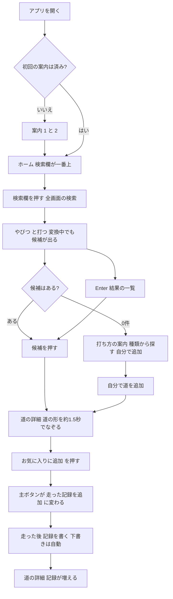

# 公道レビュー（road-review）PRD v3（検索が主役の版・案）

- ステータス: **案（CEO の確認待ち）**
- 作成: feature-planner（CPO 配下）／作成日: 2026-10-10
- きっかけ: CEO の新しい方針（2026-10-10）と、`research-road-search-data.md` 末尾の「CEO決定（2026-10-10）」4点
- **この文書が置き換えるもの**: `road-review-prd-v2.md`（以下「PRD v2」）の **1章（価値仮説）・4章（スコープ）・5章（画面一覧）・6章（操作の流れ）・7章（データの持ち方）・8章のうち US-02／US-06／US-07／US-08／US-09／US-12／US-18／US-20・12章（スマホの受入条件）の追加分・14章（完了の定義）・15章（進め方）・17章（CEO 確認事項）**
- **この文書が置き換えないもの（PRD v2 をそのまま使う）**: 2章（ドッグフーディングの進め方の形）、3章（ペルソナ）、4.3（ずっと扱わないもの）、8章の US-01（文言だけ変える）・US-03・US-04・US-05・US-10・US-11・US-13〜US-17・US-19 の受入条件、9章（削除するもの。v1 → v2 で消すものは同じ）、10章（非機能要件）、11章（アクセシビリティ）、13章（横断的なエッジケース）、付録B（文言 N-01〜N-18。変える文言は付録Bで上書き）
- 文書の優先順位: **CEO決定 ＞ この PRD v3 ＞ DS v3 ＞ ARCH v3 ＞ v2 の各文書**
- 一緒に読む文書: `road-review-design-spec-v3.md`（以下「DS v3」）、`road-review-architecture-v3.md`（以下「ARCH v3」）、`research-road-search-data.md`（以下「データ調査」）、`ux-research-road-search.md`（以下「UX 調査」）、`road-review-v2-review.md`（以下「v2 レビュー」）、`road-review-adr-static-export.md`（以下「ADR」）
- 表記: 【事実】出典で確かめた／【推論】根拠から考えた／【未確認】確かめていない（確かめ方を書く）

用語メモ（この文書で新しく使う言葉）:
- **道のリスト（カタログ）**（アプリと一緒に配る、人が確かめた有名な道 約100本の一覧。名前・読み・別名・都道府県・種類・道の形・注意を持つ。だれが開いても同じ中身）
- **候補（サジェスト）**（検索欄に打っている途中で、下に出る「この道のことですか？」の一覧）
- **変換中（IME の未確定）**（日本語入力で、ひらがなを打って、まだ確定していない文字。下線が付いている状態）
- **なぞる動き（トレース）**（地図の上で、道の線が始まりから終わりへ伸びていくように描かれる動き）
- **お気に入り**（気になる道に ♡ を付けてためておくこと。v2 の「道の登録」の代わり）
- **自分で追加した道**（道のリストにない道を、名前・都道府県・種類を打って自分で足したもの。v2 の「道の登録」を小さく残したもの）
- **ODbL**（OpenStreetMap のデータを使うときの決まり。出典を書くことと、取り出したデータを同じ決まりで公開することを求める）

---

## 0. CEO 決定（2026-10-10）と、v2 から変わること

| # | CEO 決定 | この PRD での扱い |
|---|---|---|
| E1 | 主な機能は「名前のある道の検索」。打っている途中で候補が出る | US-02〜US-05。ホームの一番上に検索欄 |
| E2 | 結果を選ぶと道の詳細。地図（Leaflet＋地理院タイル）の上で道を約1.5秒でなぞる。もう一度なぞるボタンあり。動きを減らす設定の人には最初から全部の線 | US-06・US-07 |
| E3 | 「道の登録」は「お気に入り（♡＋文字）」に変わる。外したときは「元に戻す」のトースト | US-08 |
| E4 | 「自分の道（マイ道）」の一覧は、お気に入りの一覧に置き換わる | US-09 |
| E5 | 走行記録・評価・道の情報は、お気に入りの道に付ける。v2 の決まり（速度・時刻・ランキングなし／安全の注意／下書きの自動保存／JSON の書き出し・読み込み／データは端末の中だけ／ログインなし／静的書き出し＋ハッシュ CSP／写真なし）は**全部そのまま** | US-10・US-11・US-13〜US-17 は PRD v2 を引き継ぐ |
| E6 | 道のデータは**ビルドのとき**に OpenStreetMap から一度だけ取り出して同梱する（月 $0）。人が確かめたリスト（`data/road-catalog-draft.json` → 承認済みのリスト）から作る。道の形は点を減らして軽くする | 7章、ARCH v3 |
| E7 | 最初は有名な道 約100本。AI が出典つきで案を作り、Hiro が確かめて OK を出す | 7.1・US-20 |
| E8 | OSM 由来の道データは ODbL で公開してよい。画面に「© OpenStreetMap」と「地理院タイル」を出す。Hiro の記録は公開しない | US-19 |
| E9 | 「自分で道を追加」は小さく残す。**検索が0件のときだけ**「見つからない道を自分で追加」を出す | US-04・US-12 |
| E10 | 検索の索引は手書き（新しい実行時の依存なし）。かな・漢字・ローマ字を同じに扱う。読み・別名を持つ。候補は6件まで、それぞれに都道府県 | US-02・US-03、ARCH v3 5章 |
| E11 | 速さをあおる動き・言葉を使わない（例: ヤビツ峠） | US-07・US-14 |

**変えないもの（中心の価値）**: 走った道の記録を、端末の中だけに、なくさずに残す。速度・時刻・タイム・ランキングは扱わない。運転中に操作させない。

**大きく変わるところ（一言で）**: v2 は「自分の記録が主役で、道は自分で作る」だった。v3 は「**道を探して形を見るのが入口**で、気に入った道に記録を足していく」になる。そのぶん、アプリの価値の一部が「道のリストの質」で決まる（データ調査 8章の1）。

---

## 1. 価値仮説シート（Gate 1。1枚）（PRD v2 1章を置き換え）

空欄（`[　]`）は CEO が決める。

| 欄 | 中身 |
|---|---|
| **用事（1つ）** | 【仮説】「次に走りに行く道を、名前で探して形と注意を確かめ、気になる道をためておき、走った後にその道に記録を残したい」。v2 では「振り返り」と「計画」のどちらが主か未確定だったが、検索が主役になったので**「計画」を主、「振り返り」を従**として書く。15分インタビューの後に確かめ直す |
| **誰の** | 【事実】最初の利用者は Hiro 本人（P0）。【仮説】その後、同じ趣味のライダー・ドライバー（PRD v2 3章の P1〜P3） |
| **成功の指標（1つ）** | 「判断日までに、**お気に入りの道の詳細を開いた**回数 M 回」（お気に入りに入れた直後と、走行記録の保存直後の10分間は数えない。使って役に立った回数を見る） |
| **入力の指標** | ①検索から道の詳細を開いた回数 S ②**検索が0件だった回数 Z**（打った言葉は残さず、回数だけ。リストの足りなさを測る）③お気に入りの数 F ④走行記録の件数 N |
| **一番危ない仮説** | 【仮説】「約100本のリストで、Hiro が探したい道の大半が見つかる」。Z ÷（検索の回数）が高ければ、この仮説は外れている。もう1つは PRD v2 から続く「月に数回以上走りに行く」（頻度は【未確認】） |
| **確かめ方** | PRD v2 2章のドッグフーディング（数字は下の 1.2 に置き換え） |
| **やめる条件** | 判断日に M が `[　]` 回未満、かつ Z の割合が `[　]`% 以上なら、CEO が「直す（リストを増やす・選び方を変える）」か「やめる」を決める |
| **判断日** | `[YYYY-MM-DD]` |

### 1.1 v3 で新しく入れる価値の仮説

- 【仮説】名前の一部を打つだけで道の形が見えると、「あの峠はどこからどこまでか」を地図アプリより早く確かめられる。
- 【仮説】「♡ を押すだけ」でためられると、v2 の「名前・都道府県・種類を打って登録」より、最初の1本までの手間が減る。
- 【推論】道の形と注意（冬季閉鎖・マイカー規制・有料）がセットで見られることは、地図アプリ（点が中心）との違いになる（UX 調査 1章）。
- 【推論】その代わり、リストにない道を探した人はがっかりする。0件のときの逃げ道（US-04・US-12）と、Z の測定が要る。

### 1.2 ドッグフーディングの数字（PRD v2 2.2 の表を置き換え）

| 指標 | 意味 | 目標 | 測り方 |
|---|---|---|---|
| M | お気に入りの道の詳細を開いた回数（除外あり。上の表） | `[　]` 回以上 | 「データ」画面の「つかったきろく」（US-18） |
| S | 検索の候補・一覧から道の詳細を開いた回数 | `[　]` 回以上 | 同上 |
| Z | 検索が0件で終わった回数（0件の表示が出たまま、別の画面へ移るか閉じた回数） | 割合で `[　]`% 以下 | 同上（言葉は残さない） |
| N | 走行記録の件数 | `[　]` 件以上 | 同上 |
| 困ったこと | 探して見つからなかった道の名前 | すべて記録する | 週1回の聞き取りで CEO が口頭で伝える（アプリには言葉を残さない） |

---

## 2. スコープ（PRD v2 4.1・4.2 を置き換え）

優先度は Must（v3 に必ず入れる）／Later（v3 の後）。v2 と同じく Should は置かない。

### 2.1 MVP v3

| # | 機能 | 優先度 | ストーリー | v2 との関係 |
|---|---|---|---|---|
| F1 | 初回の案内（2ステップ。文言だけ変える） | Must | US-01 | v2 US-01 の文言を変える |
| F2 | **道の検索（候補 6件まで・都道府県つき）** | Must | US-02, US-03 | 新規（v2 では Later） |
| F3 | **0件のときの案内と「自分で追加」の入口** | Must | US-04 | 新規 |
| F4 | **結果の一覧（Enter・すべて見る・種類から探す）** | Must | US-05 | 新規 |
| F5 | **道の詳細（道の形の地図・リストの情報・注意）** | Must | US-06 | v2 US-08・US-09 を置き換え |
| F6 | **なぞる動き（約1.5秒・もう一度・動きを減らす設定）** | Must | US-07 | 新規 |
| F7 | **お気に入り（♡＋文字・元に戻す）** | Must | US-08 | v2 US-02（道の登録）を置き換え |
| F8 | **お気に入りの一覧（種類・都道府県・並び替え3つ・まとめ）** | Must | US-09 | v2 US-06・US-07・US-12 を置き換え |
| F9 | 走行記録（総合＋景観/路面/走りやすさ＋交通量＋メモ＋道の情報の開閉＋任意の1問） | Must | US-10 | v2 US-04・US-10・US-03 をそのまま |
| F10 | 下書きの自動保存 | Must | US-11 | v2 US-05 をそのまま |
| F11 | 自分で道を追加（0件のときだけ入口が出る）・編集・削除 | Must | US-12, US-13 | v2 US-02・US-11 を小さくしたもの |
| F12 | 安全の表示（＋あおらない動き・言葉） | Must | US-14 | v2 US-13 に足す |
| F13 | 書き出し・お知らせ・読み込み（置き換え）・消えにくくする工夫 | Must | US-15 | v2 US-14〜US-17（中身の形だけ変える） |
| F14 | 外部への送信の説明（OSM のデータは同梱で、通信はしないことを足す） | Must | US-16 | v2 US-18 を直す |
| F15 | 状態の表示（道の形を読めない、を足す） | Must | US-17 | v2 US-19 に足す |
| F16 | つかったきろく（回数を3つに） | Must | US-18 | v2 US-20 を直す |
| F17 | **出典とライセンス（© OpenStreetMap・地理院タイル・ODbL のデータの配布）** | Must | US-19 | 新規 |
| F18 | **道のリストの注意（規制・確認日・出典）** | Must | US-20 | 新規 |

### 2.2 Later（v3 の後）

PRD v2 4.2 の一覧は、下の「v3 で消えたもの」を除いて**そのまま引き継ぐ**。v3 で足すもの:

| 項目 | 戻す条件 |
|---|---|
| 最近見た道（検索欄が空のときに出す） | 同じ道を何度も探していると聞き取りで分かったら（UX 調査 2-2 の提案。MVP では例の道3本で代える） |
| あいまい検索（打ち間違いを許す） | Z が高く、原因が打ち間違いだと分かったら（UX 調査 2-2・データ調査 4.3） |
| 全国の峠の点（線なし。約1,500件） | 100本で足りないと分かったら（データ調査 7.1） |
| 一覧の小さな絵（純 SVG の道の形のサムネイル） | お気に入りが増えて見分けにくいと分かったら（CEO決定 2026-10-10 の1で「一覧の小さな絵は SVG」とされたが、MVP の作る量を減らすため後回しを提案。**CEO 確認 Q5**） |
| 道の長さ（km）・標高の表示 | CEO 確認 Q6 の結果による |
| 道のリストの「この道を足してほしい」の送信 | サーバーが要るので D2（端末の中だけ）に反する。CEO の新しい決定が必要 |
| 道のリストの自動更新（毎日） | 不要（データ調査 7.3。季節に1回、手で回す） |

**v3 で消えたもの（v2 の Later から外す）**: 「名前の検索」（Must になった）、「道一覧の地図表示」（道の詳細の地図が主役になったので、一覧の地図は作らない）、「終了ピン・道詳細の全画面地図」（道の形が出るので不要。自分で追加した道のピンは v2 のまま1つ）。

### 2.3 ずっと扱わないもの

PRD v2 4.3 のまま。加えて: **現在地から近い道・近い順の並び替え・道案内（ナビ）・所要時間・道の長さから計算した時間**。打った言葉を外へ送ること。

---

## 3. 画面一覧（PRD v2 5章を置き換え）

URL は ARCH v3 6章が正。

| 画面 | 主な内容 | URL |
|---|---|---|
| S-01 初回の案内 | 2ステップ（US-01） | どの URL でも先に出す |
| S-02 ホーム | 検索欄（一番上）、種類から探す（チップ5つ）、お気に入りの先頭3本と「すべて見る」、書き出しのお知らせ | `/` |
| S-02a 検索（全画面） | 入力欄、候補6件まで、「すべて見る（N件）」の行、0件の案内 | `/#q=`（打った言葉は `#` の後ろに置く。下の注） |
| S-02b 結果の一覧 | 打った言葉か種類で当たった道の全部、都道府県で絞る | `/#q=…&all=1`、`/#type=…` |
| S-03 自分で道を追加・編集 | 名前（打った言葉が入る）・都道府県・種類・場所のピン（任意）。v2 S-03 と同じ形 | `/roads/new/`、`/roads/edit/?id=` |
| S-03a ピンのピッカー | v2 S-03a のまま | （S-03 の中） |
| S-04 道の詳細 | 種類の帯、♡、道の形の地図となぞる動き、出典、リストの情報と注意、評価のまとめ、道の情報、走行記録 | `/road/?id=` |
| S-05 走行記録の登録・編集 | v2 S-05 のまま | `/drives/new/?road=`、`/drives/edit/?id=` |
| S-06 お気に入り | まとめ（本数・都道府県・色の帯）、種類チップ・都道府県・並び替え、カード一覧 | `/favorites/` |
| S-08 データ | v2 S-08 に「道のデータ（OpenStreetMap）」の欄を足す | `/data/` |
| S-09 見つからない | 「この道は見つかりません」 | （S-04 の中） |

- **打った言葉を URL の `#` の後ろに置く理由**: `?` の後ろ（クエリ）は、再読み込みや画面の切り替えのときにサーバー（Vercel）へ送られ、アクセスの記録に残る。`#` の後ろ（ハッシュ）はブラウザの外へ送られない【事実: URL の決まり。ハッシュは HTTP の取得に含まれない】。「打った言葉は端末の外へ送らない」（US-02）を守るため。種類・都道府県・並び替えのように打った言葉でないものは、v2 と同じくクエリに置いてよい（お気に入りの一覧）。詳しくは ARCH v3 6章。
- S-07 は欠番（v2 と同じく作らない）。S-06 は v2 では欠番だった番号を「お気に入り」に使う。
- 下のタブバーは作らない（v2 と同じ）。行き先は「ホーム」「お気に入り」「データ」の3つになるが、**ホームの中にお気に入りの先頭とリンクがある**ので、上のバーの右に「データ」、ホームの中に「お気に入り」の入口、で足りる【推論】（DS v3 3章）。

---

## 4. 操作の流れ（初めての人）

**ゴール**: 初めての人が1分以内に「気になる道を見つけて、形を見て、♡ を押す」。
→ **そのために** ホームを開いた瞬間に検索欄が見え、押せばすぐ打てる。
→ **さらにそのために** 1文字目から候補が出て、押せば1歩で道の形まで行ける。
→ **その先で** 走った後、お気に入りから開いて記録を残す。

---

## 5. ユーザーストーリーと受入条件

**共通の前提**: PRD v2 8章の「共通の前提」をそのまま使う（日本時間で判定・入力チェック・二重保存の防止・電波の有無で保存は失敗しない）。加えて:
- 道のリストはアプリと一緒に配るので、**検索は電波がなくても動く**（画面がすでに開いていれば）。道の形のファイルと地図の画像は電波が要る【推論・ARCH v3 4章】。
- **打った言葉は端末の外へ送らない**。どこにも保存しない（回数だけ数える。US-18）。

### US-01 初回の案内を見る（文言だけ変える）
PRD v2 US-01 の受入条件を**そのまま**使う。ステップ1の文と絵だけ変える。
- [ ] ステップ1の文は N-01v3「峠やスカイラインを名前で探して、道の形を見られます。気に入った道は ♡ でためて、走った後に記録を残せます。登録は不要。記録はこの端末の中だけに保存されます。」。
- [ ] ステップ1の手順の3行は「1 名前で道を探す」「2 ♡ でお気に入りにする」「3 走った後に、評価とメモを残す」。
- [ ] ステップ2は v2 のまま（安全の約束・データの保存場所・iPhone のホーム画面の1行）。

### US-02 道を名前で探す（候補が出る）
次に走る道を考えるとき、名前の一部を打つだけで、その道を見つけたい。

- [ ] Given ホーム When 検索欄を押す Then 検索の全画面（S-02a）に切り替わり、入力欄にフォーカスがあり、キーボードが出る。URL は `/#q=`。
- [ ] Given 検索の全画面で入力欄が空 Then 「たとえば」として例の道3本（CEO が選ぶ。Q7）を出す。候補の一覧は出さない。
- [ ] Given 1文字以上を打った When 文字が変わるたびに Then 候補を**待たずに**更新する（端末の中で探すので通信しない）。
- [ ] 候補は**最大6件**。各行に「種類の記号＋種類名」「道の名前」「都道府県」を出す。都道府県は必ず出す。
- [ ] Given 当たる道が7件以上 Then 6件の下に「『{打った言葉}』の道をすべて見る（{N}件）」の行を出す。
- [ ] 候補の一覧の中だけのスクロールは作らない（360×640 でキーボードが出ていても、一覧の中にスクロールバーが出ない）。
- [ ] 候補の並び（ARCH v3 5.4 が正）: ①名前・別名が打った言葉で**始まる** ②読み・ローマ字が打った言葉で始まる ③名前・別名の途中に含む ④読みの途中に含む ⑤都道府県名に当たる。同じ段の中は、リストの「有名さの順」→ 都道府県の番号（北から）→ 名前の順。**お気に入りかどうかで順番は変えない**（毎回同じ並びにして予想できるようにする）。お気に入り済みの行には「♥ お気に入り」を出す。
- [ ] 名前の中で打った言葉と合った部分を**太字**にする。かなで打って漢字の名前に当たったとき（太字にできる所がない）は、名前の下に読みを小さく出す（例: 碓氷峠／うすいとうげ）。別名で当たったときは「別名: 〇〇」を小さく出す。
- [ ] Given 候補の1行を押す Then その道の詳細（`/road/?id=…`）へ移る。戻ると、打った言葉を残した検索の全画面に戻る。
- [ ] Given 候補が出ている When Enter（キーボードの「検索」）を押す Then 結果の一覧（US-05）へ移る。候補が1件だけでも一覧へ移る（Enter はいつも一覧）。
- [ ] 入力欄は `type="search"`・`enterkeyhint="search"`・文字 16px。部品は WAI-ARIA のコンボボックス（DS v3 6-1）。
- [ ] 自分で追加した道も候補に出す。行に「自分で追加」の小さな札を付ける。
- [ ] 読み上げ: 打ち終わってから約0.5秒後に「候補 6件。上下の矢印で選べます」のように件数を1回だけ知らせる（`role="status"`）。
- [ ] 打った言葉は、通信にも、端末の保存場所にも残らない（E2E で通信先と localStorage・IndexedDB の中身を検査）。

### US-03 書き方が違っても見つかる（かな・漢字・ローマ字・IME）
正しい書き方を知らなくても、思いついた書き方で見つけたい。

**同じに扱うもの（ARCH v3 5.2 が正）**

| ゆれ | 例 | 期待 |
|---|---|---|
| ひらがな／カタカナ | 「やびつ」「ヤビツ」 | どちらも「ヤビツ峠」が1番目 |
| 全角／半角 | 「ﾔﾋﾞﾂ」「ＹＡＢＩＴＳＵ」 | 同じ |
| 漢字／読み | 「うすい」「碓氷」 | どちらも「碓氷峠」 |
| ローマ字（ヘボン式・訓令式・のばす音の有無・大文字小文字） | 「yabitsu」「yabitu」「Yabitsu Touge」「yabitsutoge」「usui」 | 当たる |
| 打っている途中のローマ字 | 「yabi」「yabits」 | 「ヤビツ峠」が出る |
| ヶ・ケ・ヵ | 「三ヶ根」「三ケ根」「三ヵ根」 | 同じ道 |
| 空白・中黒・ハイフン・長音 | 「西伊豆 スカイライン」「信貴・生駒」「信貴生駒」 | 同じ |
| 別名・正式名 | 「船原西浦高原線」「県道127号」 | 「西伊豆スカイライン」（別名: 〜）が出る |
| 空白で区切った2語 | 「スカイライン 静岡」 | **両方の言葉に当たる道だけ**（静岡県のスカイライン） |

**受入条件**
- [ ] 上の表のすべての例が、単体テストで期待どおりになる（ARCH v3 9章の表）。
- [ ] **変換中（IME の未確定）**: Given 「やびつ」と打って未確定 Then 候補に「ヤビツ峠」が出る（未確定の文字でも候補を更新する）。
- [ ] Given 変換中 When Enter を押す（変換の確定） Then **候補を選ばない・一覧へも移らない**（文字が確定するだけ）。↑↓ も変換の候補選びとして扱い、候補の一覧を動かさない（判定は `isComposing` と `keyCode === 229` の両方。UX 調査 2-3）。
- [ ] Given 変換を確定した直後 When もう一度 Enter Then 結果の一覧へ移る。
- [ ] 変換中は、打っている文字をそのまま候補の行として出さない（入力欄に見えているため）。
- [ ] 1文字の打ち間違い（「やびす」）は直さない（あいまい検索は Later）。0件の案内（US-04）で補う。
- [ ] 【未確認・実機】iPhone の日本語かなキーボード（フリック入力）で、確定前に候補が出ること・確定の Enter で移らないこと。**CEO の iPhone 実機確認（ARCH v3 10章。段階13 の Preview で、段階14 に進む前）**で確かめる。

### US-04 見つからないとき（0件）
探した道がリストになくても、次に何をすればよいか分かりたい。

- [ ] Given 当たる道が0件 Then 候補の場所に「『{打った言葉}』に合う道はありません」（見出し）を出し、`role="status"` で知らせる。打った言葉は入力欄に残す。
- [ ] その下に「ためしてみてください」として、①名前の一部だけをひらがなで打つ（例: やび、すかい）②「峠」「スカイライン」を消して打つ、の2行。冗談・おどけた絵は使わない。
- [ ] その下に「種類から探す」のチップ5つ（押すと結果の一覧 `/#type=…`）。
- [ ] **その下に、0件のときだけ**「リストにない道は、自分で追加できます」と［＋ 見つからない道を自分で追加］（secondary）を出す。押すと S-03（`/roads/new/#name={打った言葉}`）を開き、名前の欄に打った言葉が入っている（50文字を超える分は切る）。
- [ ] 候補が1件以上あるときは、この追加のボタンを**どこにも出さない**（E9）。ホーム・お気に入り・データの画面にも出さない。
- [ ] 0件の表示が出たまま、別の画面へ移るか検索を閉じたら、Z（US-18）を1増やす。打つたびに数えない。

### US-05 結果の一覧（Enter・すべて見る・種類から探す）
「スカイライン」のように1本に決まらない言葉で、当たる道を全部見比べたい。

- [ ] Given Enter または「すべて見る」 Then `/#q={言葉}&all=1` で、当たる道を**全部**、US-02 と同じ並びで出す。件数「『スカイライン』 12件」を `role="status"` で出す。
- [ ] Given ホームか0件の画面で種類チップを押す Then `/#type={種類}` で、その種類の道を全部（リスト＋自分で追加した道）、都道府県の北から順に出す。
- [ ] 一覧の上に都道府県の絞り込み（1つ選ぶ。「すべて」が既定）。**県をまたぐ道は、どの県を選んでも出る**（例: 箱根スカイラインが神奈川県と静岡県にまたがるなら、どちらでも出る）。
- [ ] 各行はカード（DS v3 6-4）: 種類・名前・都道府県（2つまでは「神奈川県、静岡県」、3つ以上は「長野県、岐阜県 ほか1県」）・お気に入り済みなら「♥ お気に入り」。
- [ ] 絞り込みの条件は URL のクエリに残す（道の詳細から戻ると同じ一覧）。端末には覚えない。
- [ ] Given 都道府県で絞って0件 Then 「この都道府県に合う道はありません」と［絞り込みをやめる］。

### US-06 道の詳細を見る（道の形・リストの情報）
選んだ道が「どこからどこまで」なのか、どんな注意があるのかを1画面で知りたい。

- [ ] 上から: 上のバー（‹ もどる）→ 種類の帯（種類・名前・都道府県・お気に入り済みなら帯の右上に ♥ ボタン）→ 林道の注意（林道のとき）→ **道の形の地図（高さ 240px）** → 出典の行 → 「地図アプリで開く」→ 「この道について」（区間「〇〇 〜 〇〇」・別名）→ 「リストの注意」（US-20）→ 評価のまとめ（記録があるとき）→ 道の情報（あなたの記録）→ 走った記録。並びは DS v3 5-5。
- [ ] 地図は**動かない**（指で動かさない・拡大縮小しない。v2 と同じ）。道全体が入る大きさに合わせる。始まりに●、終わりに○の印。
- [ ] 地図の読み上げ名は「{名前}の道の形を示す地図。{都道府県}」（`role="img"`）。
- [ ] 下の主ボタン: まだお気に入りでない → 「♡ お気に入りに追加」。お気に入り → 「＋ 走った記録を追加」（US-08）。
- [ ] 「地図アプリで開く」は道の区間の真ん中あたりの点（リストの代表点）を地図アプリに渡す。押したときだけ外に位置が渡ることを横に小さく書く（v2 US-09 と同じ）。
- [ ] 道の長さ・所要時間・速度は出さない（長さは Q6）。
- [ ] Given 自分で追加した道 Then 道の形の地図の代わりに v2 と同じ「ピン1つの小さな地図」（ピンがなければ「場所: 未設定」と［地図で場所を置く］）。「リストの注意」は出さず、「自分で追加した道です」と出す。
- [ ] Given 存在しない ID・形が正しくない ID Then S-09（N-16v3「この道は見つかりません。リストから外されたか、この端末には記録がありません。」と［ホームへ］）。
- [ ] Given リストから外された道（ARCH v3 3.5 の「引退」）で、お気に入りか記録がある Then 詳細は開ける。帯の下に「この道は今のリストにはありません」と出し、検索には出さない。
- [ ] 本文（名前・注意・記録）は地図の読み込みを待たずに出る。

### US-07 道の形をなぞる動きを見る
道の形を「始まりから終わりへ」の流れで、ひと目でつかみたい。ただし速さを感じさせない。

- [ ] Given 道の詳細を開く（動きを減らす設定ではない） Then 地図を道全体に合わせた後、始まりの●を出し、線が始まりから終わりへ**約1.5秒（1.2〜2.0秒の範囲）**で伸び、最後に終わりの○を出す。**1回だけ**。くり返さない。
- [ ] 線は種類の solid 色・太さ 5px・端は丸・下に白い 2px のふち（DS v3 4-8）。
- [ ] 地図の画像（タイル）の読み込みは最大0.5秒だけ待つ。それより遅ければ、背景を待たずに線を描き始める。
- [ ] Given 画面が隠れている（別のタブ・別のアプリ）ときに開いた Then 見えるようになってから動かす。
- [ ] 地図の左下に「↻ もう一度なぞる」（記号＋文字、44px）。押すと最初から1回なぞる。動いている途中で押したら、最初からやり直す。
- [ ] Given 端末の「動きを減らす」設定（`prefers-reduced-motion: reduce`） Then 最初から全部描いた線と両端の印を出す。「もう一度なぞる」は出さない。
- [ ] 線が2本以上に分かれている道（途中が切れている）は、順番に1本ずつなぞる。全体の時間は同じ範囲に収める。
- [ ] 動いている間も、ほかの文字は読めて、ボタンは押せる（動きを待たせない）。
- [ ] **あおらない**: 車・バイクの絵、矢印、動く点、残像、速さを表す線、加速して見える動き（だんだん速くなる）は使わない。動きの速さはほぼ一定（DS v3 4-7 の ease-trace）。効果音なし。振動なし。
- [ ] 読み上げは動きを読まない（地図の説明文で伝える）。

### US-08 お気に入りに入れる・外す
気になる道を、ワンタップでためておきたい。間違えて外しても戻したい。

- [ ] Given まだお気に入りでない道の詳細 Then 下の主ボタンは「♡ お気に入りに追加」（ふちだけの ♡＋文字）。
- [ ] Given 押す Then 端末の中に保存し、トースト「お気に入りに追加しました」（`role="status"`）を出す。下の主ボタンは「＋ 走った記録を追加」に変わり、帯の右上に「♥ お気に入り」（塗った ♥＋文字、44px、`aria-pressed="true"`）が出る。フォーカスは帯の ♥ ボタンに移す（押したボタンが消えるため）。
- [ ] Given 帯の「♥ お気に入り」を押す Then **確認を出さずに**外す。トースト「お気に入りから外しました」と［元に戻す］を出す。下の主ボタンは「♡ お気に入りに追加」に戻る。
- [ ] トーストは **8秒**出す。フォーカスかポインターがトーストの上にある間は消さない。［元に戻す］は 44px。
- [ ] Given ［元に戻す］を押す Then 外す前と**同じ記録**（追加した日時も同じ）に戻す。トーストは「元に戻しました」に変わる。
- [ ] トーストが消えた後でも、もう一度 ♡ を押せば入れ直せる（戻す方法をトーストだけにしない）。
- [ ] Given お気に入りの一覧（S-06）でカードの ♥ を押す Then 同じく外れ、一覧から消え、同じトーストを出す。［元に戻す］で同じ場所に戻る。
- [ ] Given 走行記録がある道を外す Then **走行記録は消さない**。その道はお気に入りの一覧の下の「記録がある道（お気に入り以外）」に出る（Q2）。
- [ ] Given 保存に失敗（容量不足など） Then ボタンの状態を元に戻し、エラーのトースト（`role="alert"`、自動で消さない、［もう一度］）。
- [ ] 連打しても、お気に入りの記録は1つだけ（同じ道に2つできない）。
- [ ] お気に入りの上限は 500本。超えるときは「お気に入りは500本までです」。
- [ ] 初めてのお気に入りの後、PRD v2 US-17 の「保存の保護をブラウザに頼む」を行う（v2 は「初めての記録の保存」だった。お気に入りも記録なので同じ扱い）。

### US-09 お気に入りの一覧を見る（`/favorites/`）
ためた道を一覧で眺め、次に行く道を選びたい。走った道の数も眺めたい。

PRD v2 US-06（道一覧）・US-07（絞り込み・並び替え）・US-12（まとめ）の受入条件を、「道」を「お気に入りの道」に読みかえて使う。変わる所だけ書く。

- [ ] ホームには、お気に入りの**先頭3本**（並びは「最近お気に入りにした順」）と「お気に入りをすべて見る（{N}本）」を出す。全部は `/favorites/`。
- [ ] `/favorites/` の上部に v2 のまとめ（「走った道 N本」「N都道府県」と色の帯）。**「走った道」はお気に入りかどうかに関係なく、走行記録が1件以上ある道の数**。都道府県は、走った道がまたがる県を**すべて**数える（Q8）。
- [ ] 絞り込み: 種類チップ（1つ選ぶ）・都道府県（1つ選ぶ。県をまたぐ道はどれでも出る）。並び替え: 「お気に入りにした順」（既定）／「最近走った順」／「評価が高い順」の3つ（v2 の「名前順」を外す。**Q9 で CEO が確定**）。評価が高い順では記録のない道を最後に置く（v2 US-07 と同じ）。条件は URL のクエリに残す。
- [ ] カード: 種類・名前・都道府県・「♥」ボタン（外す）・評価の平均と「N回走った」か「まだ走った記録がありません」。
- [ ] 一覧の下に「記録がある道（お気に入り以外）」（あれば）。外した道でも、記録が見返せる。
- [ ] Given お気に入りが0本 Then E-01v3: 「まだお気に入りがありません。検索で道を探して、♡ を押すとここに並びます。」と［道を探す］（検索の全画面へ）と例の道3本。
- [ ] 下の主ボタンのバーは置かない（主な操作は「探す」で、ホームにあるため）。上のバーは「‹ ホーム」「お気に入り」。

### US-10 走行記録を書く
**PRD v2 US-04（走行記録）・US-10（道の情報）・US-03（林道の注意）の受入条件をそのまま使う。** 変わる所だけ:
- [ ] 走行記録を書けるのは**お気に入りの道か、自分で追加した道**。お気に入りでない道の詳細では「＋ 走った記録を追加」を出さない（主ボタンは ♡）。
- [ ] Given お気に入りでない道で `/drives/new/?road=…` を直接開いた Then 「この道はお気に入りではありません」と［お気に入りに追加して書く］（押すとお気に入りにしてフォームへ）。
- [ ] Given お気に入りから外した道に記録がある Then その記録の編集・削除はできる（`/drives/edit/?id=`）。
- [ ] 60秒・3タップの条件（v2 US-04）は「お気に入りの道の詳細から」数える。
- [ ] 「リストの注意」（US-20）と「道の情報（あなたの記録）」は別のもの。フォームの道の情報は v2 のまま「あなたの記録」。

### US-11 下書きが自動で残る
**PRD v2 US-05 をそのまま使う。** 対象は「自分で追加した道の追加・編集」「走行記録の登録・編集」。下書きのキーは ARCH v3 8.3。

### US-12 見つからない道を自分で追加する
リストにない林道などを、自分で足して記録したい。

**PRD v2 US-02（道の登録）の受入条件をそのまま使う**（名前・都道府県・種類が必須、場所のピン1つは任意、同じ名前の注意、林道の注意、地図が読めないとき）。変わる所だけ:
- [ ] 入口は**検索0件の画面（US-04）だけ**。名前の欄には打った言葉が入っている（直せる）。
- [ ] 画面名は「自分で道を追加」。主ボタンは「追加して ♡ お気に入りにする」。保存すると、自分で追加した道として保存し、**同時にお気に入りに入れて**、その道の詳細へ移る。トースト「道を追加して、お気に入りにしました」。
- [ ] Given 打った名前がリストの道の名前・別名と同じ（そろえた形で一致） When 保存 Then 止めずに「リストに『{名前}』（{都道府県}）があります」とリンクを出す（同じ名前でも別の道のことがあるため）。
- [ ] 自分で追加した道は、上限 200本。
- [ ] 自分で追加した道は検索の候補にも出る（「自分で追加」の札つき）。

### US-13 編集・削除する
**PRD v2 US-11 をそのまま使う。** 読みかえ:
- [ ] 「道の編集・削除」は**自分で追加した道だけ**。リストの道は編集・削除できない（お気に入りから外すだけ）。
- [ ] 自分で追加した道を削除すると、その道の走行記録・お気に入り・下書きを**1回の処理でまとめて**消す。確認の文「この道を削除すると、走行記録{N}件も削除されます。元に戻せません。」。
- [ ] 「この端末の記録をすべて削除」は、お気に入り・自分で追加した道・走行記録・下書き・つかったきろくを消す。道のリスト（アプリに入っているもの）は消えない。

### US-14 安全の表示（あおらない）
**PRD v2 US-13 をそのまま使う。** 足すもの:
- [ ] 禁止語の自動テストの対象を、**画面の文言に加えて、道のリストの全ての文字**（名前を除く: 区間・注意・別名の説明）に広げる。
- [ ] 禁止語に足す言葉: 「走り屋」「攻める」「攻略」「ドリフト」「全開」「ぶっ飛ばす」「飛ばす」「ゼロヨン」「ローリング」「峠を責め」「タイムアタック」「ベストライン」。
- [ ] 道の詳細・リストの注意に、取り締まり・事故・走り屋の集まりなど、速さを話題にする情報を載せない（ヤビツ峠の Wikipedia の記述など。データ調査 8章の6）。
- [ ] なぞる動きの決まり（US-07 の「あおらない」）を守っていることを、画面写真（途中のコマ）で確かめる。

### US-15 書き出し・お知らせ・読み込み・消えにくくする
**PRD v2 US-14〜US-17 をそのまま使う。** 変わる所だけ:
- [ ] 書き出すファイルの中身は「お気に入り・自分で追加した道・走行記録」（形は ARCH v3 8.4）。道のリストそのものは入れない（だれでも同じなので）。
- [ ] 書き出し完了の文 N-08v3「書き出しました（お気に入り{a}本・自分で追加した道{c}本・走行記録{b}件）」。
- [ ] 読み込みの検査（v2 US-16 の検査1〜10）に足す: ⑪走行記録の道が「ファイルの中の自分で追加した道」か「リストの道の ID の形」であること ⑫お気に入りの道も同じ。**今のリストにない道の ID（引退した道・新しい版のリストの道）は、拒否せずに読み込む**（お気に入りに保存してある名前で表示する。ARCH v3 8.4）。
- [ ] 「書き出しのお知らせ」の「変更」には、お気に入りの追加・外す、も数える。
- [ ] 初めて保存（お気に入り・自分で追加・走行記録のどれか）した直後に、保存の保護を頼む（v2 US-17 の「初めて記録を保存した」を読みかえ）。書き出しのお知らせの「初めての記録の直後」は、**初めての走行記録の保存の直後**のまま（お気に入りだけでは出さない。うるさくしないため）。

### US-16 外部への送信を知る
**PRD v2 US-18 をそのまま使う。** 「この端末の外に送られるもの」の文に、次の1段落を足す:
> 道のリスト（名前・道の形）はアプリと一緒に配られています。検索で打った言葉は、どこにも送られません。道の形のデータは OpenStreetMap から作りましたが、アプリが OpenStreetMap のサーバーと通信することはありません。

- [ ] テスト（v2 の通信先の検査）に足す: 検索・道の詳細・お気に入りの流れで、通信先が「アプリ自身」と「地理院の地図」だけ。`openstreetmap.org`・`overpass-api.de` への通信が0件。打った言葉が、通信の URL（アプリ自身への取得を含む）のどこにも出てこない（E2E で全部の取得の URL を検査）。

### US-17 状態の表示
**PRD v2 US-19 の表をそのまま使う。** 足す行:

| 状態 | 場所 | 表示 |
|---|---|---|
| 道の形を読めない（電波がない・ファイルがない） | 道の詳細 | 地図の場所に「道の形を読み込めませんでした。」と［再読み込み］。名前・注意・記録はそのまま出す |
| 道の形のデータがない道（リストの準備中など） | 道の詳細 | 「この道の形のデータはまだありません」と都道府県名。♡ と記録はできる |
| 地図の画像だけ読めない | 道の詳細 | 背景なしで線だけを描く。地図の右下に「地図を読み込めませんでした」 |
| 0件 | 検索・結果の一覧 | US-04・US-05 |

### US-18 つかったきろく
**PRD v2 US-20 を置き換え。**
- [ ] 端末の中（localStorage）に回数だけ数える: ①M（1章の決まり）②S ③Z ④走行記録の保存回数。**打った言葉・道の名前・道の ID は残さない**。
- [ ] 「データ」画面の「つかったきろく」に4つの回数を出す。書き出しには入れない（v2 と同じ）。
- [ ] 任意の1問（`helpfulNote`）は v2 のまま。

### US-19 出典とライセンスを知る（ODbL）
道のデータの元と、使ってよい条件を知りたい。データを使いたい人は手に入れられるようにする。

- [ ] 道の形の地図の**右下**に「© OpenStreetMap」（著作権ページ https://www.openstreetmap.org/copyright へのリンク）と「地理院タイル」（一覧ページ https://maps.gsi.go.jp/development/ichiran.html へのリンク）を常に出す。ボタン・トースト・シートで隠さない。
- [ ] 地図の下に、押しやすい大きさ（44px）の出典の行「地図: 地理院タイル　道の形: © OpenStreetMap 協力者（ODbL）」を出す（地図の隅の小さな文字は押しにくいため）。
- [ ] 「データ」画面に「道のデータについて」の欄: ①「道の形は OpenStreetMap のデータから作りました。© OpenStreetMap 協力者。」②ODbL の表示文（日本語と原文: “Contains information from OpenStreetMap, which is made available here under the Open Database License (ODbL).”）③［道のデータをダウンロード（ODbL）］（同梱の JSON 一式。ARCH v3 3.6）④リストの版（例「道のリスト 2026-10-20 版・98本」）。
- [ ] あなたの記録（お気に入り・走行記録）は ODbL の対象ではなく、公開されないことを同じ欄に1行で書く。
- [ ] 自分で追加した道だけの詳細（OSM のデータを出さない画面）では、OSM の表示は出さなくてよい（地理院タイルの表示は v2 のまま出す）。

### US-20 道のリストの注意（規制・確認日・出典）
通れない道・お金のかかる道を、出かける前に知りたい。ただし公式情報ではないことも分かりたい。

- [ ] 道の詳細の「リストの注意」に、リストが持つ注意を出す（種類: 冬季閉鎖・夜間通行止め・マイカー規制・有料・二輪通行止め・自転車通行不可・その他）。各注意に「確認 2026/10/20」と出典のリンクを付ける。
- [ ] 注意の上に常に「公式情報ではありません。出かける前に道路管理者の情報を確認してください。」（v2 の M-06）。
- [ ] Given リストが規制を確かめていない道 Then 「規制の情報は未確認です」と出す（空の欄にしない。データ調査 8章の7）。
- [ ] Given 注意の確認日が今日から366日以上前 Then 「確認から1年以上たっています」を出す（v2 US-10 の境界と同じ）。
- [ ] Given マイカー規制など「車で走れない時期・区間がある」道 Then 注意を帯のすぐ下（林道の注意と同じ場所）にも出す。
- [ ] リストの注意は利用者が編集できない。利用者の「道の情報（あなたの記録）」とは見出しと見た目で分ける。

---

## 6. データの持ち方（考え方の段階。物理設計は ARCH v3）（PRD v2 7章を置き換え）

### 6.1 2種類のデータを分ける

| 種類 | 中身 | どこにあるか | 書き出し | ライセンス |
|---|---|---|---|---|
| **道のリスト** | 名前・読み・別名・都道府県・種類・区間・注意・道の形 | アプリと一緒に配る（静的ファイル） | 入れない | 道の形は ODbL（名前・読み・注意は人が確かめて付けたもの。全体を ODbL として公開） |
| **あなたの記録** | お気に入り・自分で追加した道・走行記録（中に道の情報）・設定・下書き・回数 | 端末の中だけ（v2 と同じ） | 入れる（設定・下書き・回数は除く。v2 と同じ） | 公開しない |

### 6.2 エンティティ（考え方）

- **道の鍵（roadKey）**: 道を指す文字列。リストの道は `yabitsu-toge` のような英小文字の名前（一度決めたら変えない）。自分で追加した道は `own-` ＋ 端末で作った ID。走行記録とお気に入りは、この鍵で道を指す。
- **Favorite（お気に入り）**: 道の鍵・お気に入りにした日時・**そのときの名前と都道府県と種類の控え**（リストから道が外れても表示できるように）。
- **CustomRoad（自分で追加した道）**: PRD v2 7.2 の Road と同じ項目（名前・都道府県1つ・種類・場所のピン1つ任意）。
- **Drive（走行記録）**: PRD v2 7.2 の Drive と同じ項目。ただし `roadId` の代わりに `roadKey`。
- **RoadInfo（道の情報）**: v2 のまま走行記録の中。
- **Meta・Draft・UsageLog**: v2 のまま（UsageLog の数える物だけ US-18 に変える）。
- 物理的な型・上限・保存場所の正は ARCH v3 8章。

### 6.3 v2 からの変更点と理由

| 変更 | 理由 |
|---|---|
| Road（自分で登録）→ リストの道＋お気に入り＋自分で追加した道 | E3・E9 |
| 走行記録の `roadId` → `roadKey` | リストの道（変えない名前の鍵）と自分で追加した道（端末で作る ID）の両方を指すため |
| お気に入りに名前の控えを持つ | リストの道が外れても（引退）、記録の意味が分かるように |
| 道が複数の都道府県を持てる（リストの道だけ） | 県をまたぐ道があるため（UX 調査 4-2）。自分で追加した道は v2 のまま1つ |
| 書き出しの中身が3種類に | 6.1 |
| 保存データの形の版は **1 から始める** | v2 の形は一度も公開していない（今の本番は v1 の Supabase 版）ので、v3 の形を最初の版にする【事実: `package.json` に Supabase がまだあり、v2 は未実装】 |

---

## 7. 道のリストの決まり（運用）

### 7.1 作り方と承認（CEO決定 2026-10-10 の2）

**ゴール**: 検索で出る道が、正しい名前・読み・区間・注意を持っている。
→ **そのために** AI が出典つきで案を作り、Hiro が1本ずつ確かめて OK を出したものだけをアプリに入れる。
→ **さらにそのために** 案（`data/road-catalog-draft.json`）と承認済み（`data/road-catalog.json`）を別のファイルにし、承認済みだけからビルドする（ARCH v3 3章）。

- [ ] 案の各道には、名前・読み・別名・都道府県・種類・区間（どこからどこまで）・注意・**出典の URL と確認日**を付ける。Wikipedia の文章は写さない（名前・読みなどの事実を確かめる参考にだけ使う。データ調査 1.4）。
- [ ] Hiro が承認した道だけ、`status: "approved"`・承認日を付けて承認済みのファイルへ移す。
- [ ] 承認済みのファイルが決まり（ARCH v3 3.3）を満たさないと、CI が止まる（US-14 の禁止語の検査を含む）。
- [ ] 道の ID（鍵）は一度出したら変えない・使い回さない。リストから外すときは消さずに「引退」にする（ARCH v3 3.5）。

### 7.2 選び方（推奨。CEO 確認 Q3）

- 有名なスカイライン・各地方の代表的な峠・海岸線・林道を混ぜて約100本。
- **マイカーで走れない道（例: 乗鞍スカイラインは 2003-05-15 から全面マイカー規制【事実: データ調査 7.2】）は、入れる場合は注意を帯の下に必ず出す**（US-20）。入れるかどうかは承認のときに Hiro が決める。

### 7.3 更新

- 季節に1回、取り出しスクリプトを手で回し、前回との差を見て、Hiro が確かめてから入れる（データ調査 7.3）。
- 規制・注意の確認日が1年を超えた道は、更新の候補として一覧にする（ARCH v3 3.7 の報告）。

---

## 8. スマホの受入条件（PRD v2 12章に足す）

PRD v2 12章の MB-1〜MB-10 を、v3 の全画面（S-02a・S-02b・S-06 を含む）に適用する。足すもの:

| # | 受入条件 | 確かめ方 |
|---|---|---|
| MB-11 | **候補がキーボードに隠れない**: 390×844 でキーボードが出ている状態（高さの約半分）で、候補の1件目と、入力欄が見える。360×640 では候補の少なくとも1件目が見える | Playwright で画面の高さを縮めて（キーボードの代わり）撮る＋実機 |
| MB-12 | **候補の行は 56px・押せる範囲いっぱい**。「‹」「×」は 44px | 部品の大きさの自動検査 |
| MB-13 | **地図の出典が隠れない**: 道の詳細の地図の右下の出典が、下の主ボタンのバー・トーストに重ならない | 画面写真（トーストを出した状態を含む） |
| MB-14 | **なぞる動きが本文をずらさない**: 地図の枠は最初から 240px で、動きや読み込みで高さが変わらない（CLS 0.1 以内） | Lighthouse・画面写真 |
| MB-15 | **トーストの［元に戻す］が親指で届く**: トーストは下の主ボタンのバーの上 12px。［元に戻す］が 44px | 画面写真 |
| MB-16 | **長い名前・県をまたぐ道でも崩れない**: 名前が20文字（例: 「〇〇〇〇〇〇〇〇〇〇スカイライン」）、都道府県が3つの道で、候補・カード・帯の文字が切れずに折り返す（帯は2行まで） | 見本のデータで画面写真 |

---

## 9. 完了の定義（DoD）（PRD v2 14章を置き換え）

PRD v2 14章の 1〜9 を引き継ぎ、次を足す・直す。

1. 受入条件を満たし、Vitest と Playwright が通る（スキップ0件）。**道のリストの検査（ARCH v3 3.4）が CI で通る**。
2. **画面写真による確認（必須）**: Playwright で、下の表の全部を **360×640 と 390×844** で撮る。qa-engineer が1枚ずつ見て、MB-1〜MB-16 と、文字の切れ・重なり・色だけの表現・出典の隠れがないかを表に書く。CPO が写真を見て合否を決める（写真を見ずに合格と書かない）。置き場所と残し方は v2 レビュー C-37 のとおり（ふだんは CI の成果物。公開前の最終の1組だけコミット）。

| 画面 | 撮る状態 |
|---|---|
| S-01 案内 | ステップ1・ステップ2 |
| S-02 ホーム | お気に入り0本・3本以上・書き出しのお知らせあり |
| S-02a 検索 | 入力欄が空（例の道）・「やびつ」（変換中の下線つき）・「スカイライン」（6件＋すべて見る）・0件・キーボードの高さ分を縮めた画面 |
| S-02b 結果の一覧 | 言葉で12件・種類で一覧・都道府県で絞って0件 |
| S-04 道の詳細 | なぞる動きの**途中のコマ（約0.75秒）**・終わった状態・動きを減らす設定・お気に入り前・お気に入り後（トーストつき）・外した後（元に戻すのトーストつき）・記録3件・林道・マイカー規制の注意つき・規制未確認・道の形を読めない・地図の画像を読めない・引退した道・自分で追加した道（ピンあり・なし）・見つからない |
| S-05 走行記録 | v2 と同じ（空・総合未選択のエラー・下書きを戻した） |
| S-03 自分で追加 | 名前が入った状態・同じ名前がリストにある注意 |
| S-06 お気に入り | 0本・12本・絞り込み0件・記録がある道（お気に入り以外）あり |
| S-08 データ | 道のデータの欄を含む全体・読み込みの確認・読み込みの失敗 |

3. **実機の確認**（CEO の iPhone）: v2 の項目に足して、①かなのフリック入力で「やびつ」が確定前に候補に出る ②確定の Enter で移らない ③VoiceOver で候補の件数と0件が読まれ、♥ が「お気に入り、オン」のように読まれる ④なぞる動きが1回だけ・「動きを減らす」で最初から全部 ⑤地図の出典が読める。
4. a11y の自動検査で重大・深刻0件。キーボードだけで「検索→候補を選ぶ→♡→記録→書き出し」が終わる。
5. 通信先の自動検査（US-16 の追加分を含む）が通る。
6. 禁止語・扱わない項目の自動検査（US-14 の追加分を含む）が通る。
7. ODbL の対応（US-19）がそろっている: 地図の表示・データ画面の文・ダウンロードのファイルと LICENSE。
8. Atomic Design・依存の決まり（**新しい実行時の依存は0**。ARCH v3 2章）。
9. README（アプリとコレクション全体）を v3 に直す。v2 の PRD・DS・ARCH の先頭に「v3 で一部置き換え」と書く（CEO の承認の後に行う。この文書の作成では v2 のファイルを変えていない）。
10. main に合流してから Vercel に出し、本番の URL で主な流れを1回確かめる。

---

## 10. 進め方（PRD v2 15章を置き換え）

実装の順番の正は **ARCH v3 10章の段階の一覧（段階 0〜20）**。段階0（静的書き出し＋ハッシュ CSP の確認）は ADR のとおり**済み**。

| まとまり | ゴール | 含むストーリー |
|---|---|---|
| T0 土台（段階 1〜3） | CI・片付け・CSP | 9章の削除、ADR の仕組みを本物へ |
| T1 道のリスト（段階 4〜6） | 承認済みのリストから、検査つきで道のデータと索引ができる | US-19 の一部・US-20 のデータ・7章 |
| T2 検索から ♡ まで（段階 7〜15） | 初めての人が、探す→形を見る→♡ まで、スマホでできる | US-01〜US-09、US-17、US-19、US-20、8章 |
| T3 記録とデータを守る（段階 16〜20） | 記録・下書き・自分で追加・削除・書き出し・読み込み・公開 | US-10〜US-16、US-18、9章 |
| Gate 1 | ドッグフーディング開始 | **段階 16（走行記録と下書き）が終わった時点**で始めてよい。書き出しの画面（段階 18）ができるまでは、記録が消えても戻せないことを先に CEO に伝える |

**下書き・書き出し・置き換えの読み込みは後ろへ回さない**（v2 の CEO決定 2026-10-08 1 をそのまま守る）。

---

## 11. リスク（PRD v2 16章に足す）

| リスク | 影響 | 対策 |
|---|---|---|
| リストに探したい道がない | がっかりして使わなくなる | Z を数える（US-18）。0件の逃げ道（US-04・US-12）。Gate 1 で選び方を見直す |
| リストの注意（規制）が古い・間違い | 通れない道へ向かわせる | 出典・確認日・「公式情報ではありません」・「未確認」の表示（US-20）。1年で警告 |
| リストを作る・直す仕事が続く | コード以外の作業が増える（データ調査 8章の1） | 担当と頻度を CEO が決める（Q3） |
| ODbL の義務を守り忘れる | ライセンス違反 | 出典の表示と配布ファイルを CI で検査（ARCH v3 9章） |
| なぞる動きが速さをあおる | 安全の考えに反する | US-07・US-14 の決まり、途中のコマの画面写真で確認 |
| かなのフリック入力で候補がうまく出ない | 主機能が使いにくい | CEO の実機確認を段階13 の Preview で（段階14 の前） |
| ビルドのときに Overpass に頼る | ビルドが外の都合で落ちる | ビルドでは通信しない。取り出しは手で回し、結果をリポジトリに入れる（ARCH v3 4章） |

---

## 12. CEO に決めてほしいこと（v3 で新しく・まだ決まっていないもの）

| # | 決めること | 推奨 | 理由 |
|---|---|---|---|
| Q1 | Gate 1 の数字（M・S・Z・N・期間・判断日・やめる条件）と15分インタビュー | **段階16 が終わる前に**インタビューをして埋める（v2 から保留のまま） | 使い始める前に基準がないと「動くだけ」になる |
| Q2 | 走行記録がある道をお気に入りから外したときの扱い | **記録は消さない。お気に入りの一覧の下「記録がある道（お気に入り以外）」に出す**（US-08・US-09） | 外しただけで記録が消えると取り返しがつかない（UX 調査 Q3） |
| Q3 | 約100本の選び方の基準・案を確かめる時間の確保・季節ごとの更新の担当 | 「有名なスカイライン＋各地方の代表的な峠＋海岸線＋林道少し」。確認は1本あたり数分×100本。更新は季節に1回、AI が差を出して Hiro が確かめる | リストの質が価値を決める（データ調査 8章の1） |
| Q4 | ODbL のデータの配り方 | **リポジトリの公開・非公開に関係なく、「データ」画面からダウンロードできるようにする**（US-19） | どちらでも確実に「渡せる」状態になる（データ調査 3.3） |
| Q5 | 一覧（お気に入り・結果）の小さな道の形の絵（純 SVG） | **MVP では作らない（Later）**。種類の色の箱で代える | CEO決定 2026-10-10 の1は「一覧の小さな絵は SVG」だが、作る量と画面写真の確認が増える。道の形は詳細で見られる |
| Q6 | 道の長さ（km）・標高を出すか | **標高（峠だけ・リストにあれば）は出す。長さは出さない** | 長さは所要時間を思わせやすい（UX 調査 Q5） |
| Q7 | 検索欄が空のとき・お気に入り0本のときに見せる「例の道」3本 | CEO のおすすめの道（種類が違う3本。マイカーで走れる道） | 初めての人が最初に押す道になる |
| Q8 | 県をまたぐ道を「N都道府県」でどう数えるか | **またぐ県をすべて数える** | 「その県の道を走った」と感じるのが自然【推論】 |
| Q9 | お気に入りの一覧の並び替え3つ | 「お気に入りにした順（既定）」「最近走った順」「評価が高い順」。v2 の「名前順」を外す | お気に入りは「ためた順」で見るのが自然。名前で探すときは検索を使う |
| Q10 | CEO の iPhone 実機確認の範囲と時期 | v2 の確認（保存場所・ファイル保存）に、かなのフリック入力・VoiceOver の候補・動きを減らす設定を足して、**段階13 の Preview で、段階14 の前に約15分** | 主機能の入力は実機でしか分からない |
| Q11 | 「この道について」の短い説明文を出すか | **MVP では出さない**（区間・別名・注意の事実だけ） | 説明文は書き方で速さをあおりやすく、出典の文章を写す危険もある |

---

## 付録A: v2 → v3 のストーリー番号の対応

| v3 | 中身 | v2 |
|---|---|---|
| US-01 | 初回の案内（文言を変える） | US-01 |
| US-02〜US-05 | 検索・ゆれ・0件・結果の一覧 | 新規（v2 US-07 の「名前の検索 Later」を置き換え） |
| US-06 | 道の詳細 | US-08・US-09 |
| US-07 | なぞる動き | 新規 |
| US-08 | お気に入り | US-02（道の登録）を置き換え |
| US-09 | お気に入りの一覧 | US-06・US-07・US-12 |
| US-10 | 走行記録 | US-04・US-10・US-03 |
| US-11 | 下書き | US-05 |
| US-12 | 自分で追加 | US-02（小さく残す） |
| US-13 | 編集・削除 | US-11 |
| US-14 | 安全・あおらない | US-13 |
| US-15 | 書き出し・読み込み・消えにくく | US-14〜US-17 |
| US-16 | 外部送信の説明 | US-18 |
| US-17 | 状態の表示 | US-19 |
| US-18 | つかったきろく | US-20 |
| US-19 | 出典とライセンス | 新規 |
| US-20 | リストの注意 | 新規 |
| （欠番） | 一覧の地図・電波なしで開く | US-21・US-22（Later のまま） |

## 付録B: v3 で足す・変える文言

PRD v2 付録B の N-01〜N-18 のうち、下の表にないものは**そのまま**使う。

| ID | 場面 | 文言 |
|---|---|---|
| N-01v3 | 案内 ステップ1 | 峠やスカイラインを名前で探して、道の形を見られます。気に入った道は ♡ でためて、走った後に記録を残せます。登録は不要。記録はこの端末の中だけに保存されます。 |
| N-08v3 | 書き出し完了 | 書き出しました（お気に入り{a}本・自分で追加した道{c}本・走行記録{b}件） |
| N-16v3 | 見つからない | この道は見つかりません。リストから外されたか、この端末には記録がありません。 |
| N-19 | 検索欄の案内文 | 峠・スカイラインの名前で探す |
| N-20 | 0件 | 「{q}」に合う道はありません |
| N-21 | 0件の案内 | ためしてみてください：名前の一部だけをひらがなで（例: やび、すかい）／「峠」「スカイライン」を消して |
| N-22 | 自分で追加の入口 | リストにない道は、自分で追加できます |
| N-23 | お気に入りに追加 | お気に入りに追加しました |
| N-24 | お気に入りから外す | お気に入りから外しました［元に戻す］ |
| N-25 | 元に戻した | 元に戻しました |
| N-26 | お気に入り0本 | まだお気に入りがありません。検索で道を探して、♡ を押すとここに並びます。 |
| N-27 | もう一度なぞる | ↻ もう一度なぞる |
| N-28 | 道の形を読めない | 道の形を読み込めませんでした。 |
| N-29 | 規制の未確認 | 規制の情報は未確認です |
| N-30 | 引退した道 | この道は今のリストにはありません |
| N-31 | 自分で追加の保存 | 道を追加して、お気に入りにしました |
| N-32 | 外部送信の説明（追加の段落） | 道のリスト（名前・道の形）はアプリと一緒に配られています。検索で打った言葉は、どこにも送られません。道の形のデータは OpenStreetMap から作りましたが、アプリが OpenStreetMap のサーバーと通信することはありません。 |
| N-33 | ODbL の表示 | 道の形は OpenStreetMap のデータから作りました。© OpenStreetMap 協力者。このデータは Open Database License（ODbL）で公開しています。 |

## 出典

- CEO決定（2026-10-10）: `research-road-search-data.md` 末尾
- データの事実（OSM の中身・ODbL・Overpass の方針・西伊豆スカイライン・乗鞍スカイライン）: `research-road-search-data.md` 1〜7章と出典一覧
- 検索・IME・お気に入り・動き・a11y の根拠: `ux-research-road-search.md` 2章・5章と出典一覧（NN/g・Baymard・MDN・W3C APG・WCAG）
- 静的書き出し＋ハッシュ CSP が Vercel で効くこと: `road-review-adr-static-export.md` 5章
- v2 の決まり: `road-review-prd-v2.md`、`road-review-v2-review.md`（CEO決定 2026-10-08）
