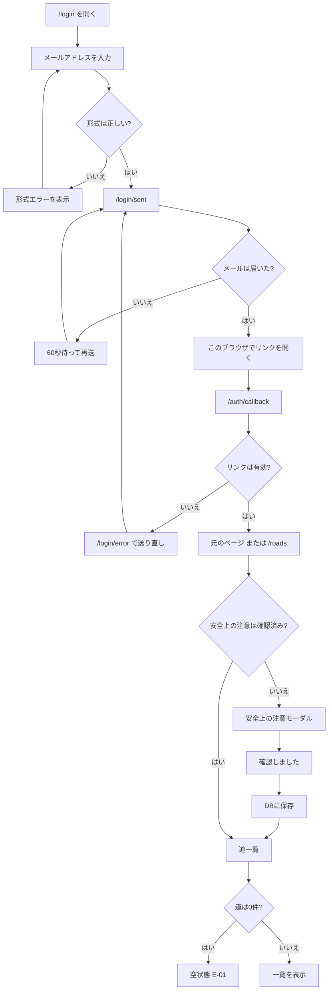
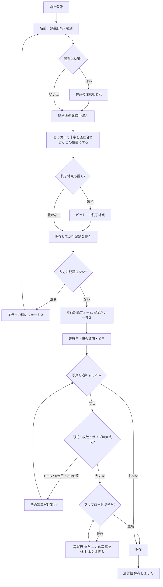
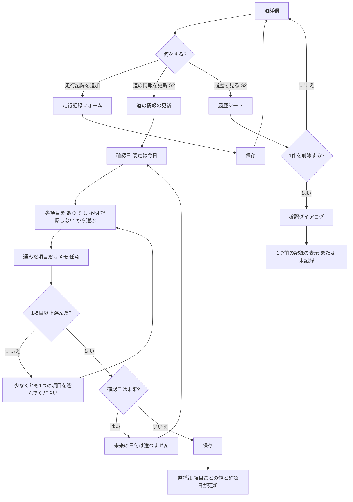
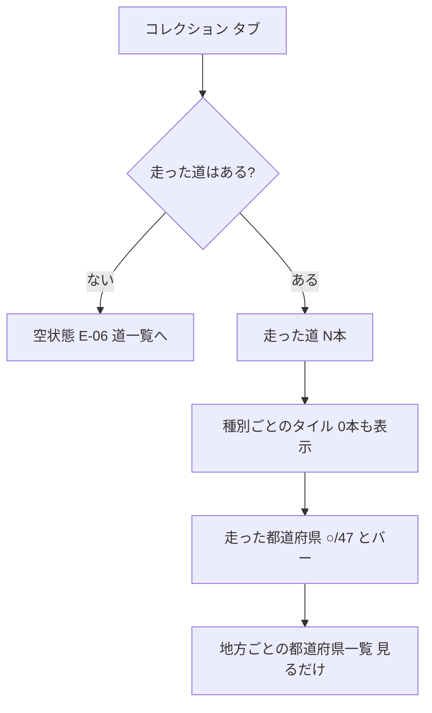

# 公道レビュー（road-review）UX設計: 画面と操作の流れ

- 作成: ux-researcher（CPOの配下）。CPOがPRD v1.1・デザイン仕様書と照らし合わせて統合した
- 作成日: 2026-10-06
- 前提（CEOの決定）:
  - MVPは非公開のみ
  - 速度・タイム・傾き角・ランキングは一切扱わない
  - ログインはメールのマジックリンクのみ
  - 種別は5つ
  - HEICは非対応、写真は1記録5枚まで、長辺2048px、EXIFは削除
  - リアルタイムGPSと現在地追従はなし。ピンは手で置く（開始は必須、終了は任意）
  - 地図は Leaflet ＋ 地理院タイル（出典表示が必須）
- スプリントの表記:
  - **[S1]** 10/07〜10/14: いちばん薄い縦切り
  - **[S2]** 10/15〜10/21: 写真・道の情報・多軸評価・地図・コレクション・編集削除
  - **[S3]** 10/22〜10/28: アクセシビリティ・性能・QA、リリース

---

## 1. 競合から学ぶこと

| プロダクト | 取り入れること | 避けること |
|---|---|---|
| **AllTrails**（トレイルのページ＋レビュー） | 「登録済みの道＋日付付きの複数の記録」という作り。記録は評価・本文・その時点の状態でできている（検索結果の要約で確認。ページ本文は取得できなかった） | 公開レビューが前提で、他人の投稿の質に左右される。MVPは非公開なので、この問題はない |
| **Google マップ**（地図＋下から出るシート） | 地図を見せたまま、下のシートで要点を見せる | シートが地図の出典表示を隠しがち。道そのものは評価できない（市場分析 4章） |
| **Strava**（避ける例として） | なし | 区間タイムのランキングに車やバイクの記録が混ざった（市場分析 7章）。速度・タイム・ランキングで競わせる仕組みは**すべて入れない** |
| **みちめぐ**（道の駅スタンプラリー） | 都道府県ごとに「いくつ訪れたか」を見せる | 全国の一覧データがあるから達成率を出せる。本アプリには道の一覧データがないので、達成率ではなく**本数**で見せる |
| **おにコレ**（国道の走破） | 走った県だけを数える考え方 | GPSの自動記録と全国ランキングは**採用しない**（走行中の利用やランキングにつながるため） |

**結論**:
- 道のページと日付付きの記録の並びは、AllTrailsの形にする。
- 地図とリストの行き来は、Google マップの形を簡単にしたものにする。
- コレクションは、自分の本数を数えるだけにする。

---

## 2. 情報の構成とナビゲーション

### 2.1 タブバー（画面幅1024px未満）

| 段階 | タブ（左から） | 移動先 |
|---|---|---|
| S1 | 「道」「設定」 | `/roads`、`/settings` |
| S2 | 「道」「コレクション」「設定」 | `/roads`、`/collection`、`/settings` |

- 画面の下に固定する。高さは56px以上にし、iPhoneの下の余白（safe-area）の分を足す。各タブのタップ領域は44×44px以上。
- 「道」タブは、`/roads` の下にある画面（詳細・編集・記録・道の情報）すべてで「選択中」にする。
- 選択中のタブは、アイコンの塗り・文字の太字・`aria-current="page"` で示す。色だけで区別しない。
- 「道を登録」は、ヘッダー右の「＋」ボタンと、道一覧の主ボタンに置く。画面の中央に大きく浮かぶ追加ボタンは作らない（「その場ですぐ記録する」印象を避けるため）。
- 入力フォーム（道の登録・編集、走行記録、道の情報の更新）とピンのピッカーでは、タブバーを隠す。入力の途中でタブを押して、内容が消えるのを防ぐため。

### 2.2 URLの構成（最終決定はCTO）

| URL | 画面 | 認証 |
|---|---|---|
| `/login` | S-01 ログイン | 不要 |
| `/login/sent` | S-02 メール送信完了 | 不要 |
| `/login/error` | S-03 ログインリンクのエラー | 不要 |
| `/auth/callback` | 認証の処理（画面なし。成功したら元のページか `/roads` へ） | 不要 |
| `/roads` | S-05 道一覧（初回は S-04 のモーダルを重ねる） | 必要 |
| `/roads/new`、`/roads/[id]/edit` | S-07 道の登録・編集 | 必要 |
| `/roads/[id]` | S-06 道詳細（S-13 の履歴シートはこの中で開く） | 必要 |
| `/roads/[id]/drives/new`、`/roads/[id]/drives/[driveId]/edit` | S-08 走行記録 | 必要 |
| `/roads/[id]/info/new` | S-14 道の情報の更新 | 必要 |
| `/collection` | S-10 コレクション | 必要 |
| `/settings` | S-11 設定 | 必要 |

- `/welcome` という画面は作らない。
- ピンのピッカー（S-07a）は、URLを持たない全画面のオーバーレイにする。まだIDがない新しい道でも使えるようにするため。ブラウザの「戻る」ではオーバーレイだけを閉じ、フォームの入力は残す。
- 存在しないIDや他人のIDを開いたときは、どちらも同じ404にする。

### 2.3 画面幅ごとのレイアウト

| 画面幅 | ナビ | 道一覧 S-05 | 道詳細 S-06 |
|---|---|---|---|
| 768px未満 | 下のタブ | S1: リストだけ。S2: 上部の切り替え「リスト｜地図」（ラジオグループ）。地図を選ぶと、地図が画面いっぱいに広がる | 1カラム。上から順に: 見出し → 林道の注意 → 評価のまとめ → 道の情報 → 地図 → 写真 → 走行記録 |
| 768px以上 | 下のタブ | S2: 左にリスト（2fr、最小320px）、右に地図（3fr。画面に固定）。切り替えボタンは出さない | 2カラム。左（7fr）: 見出し・林道の注意・評価のまとめ・走行記録。右（5fr。スクロールしても付いてくる）: 道の情報・地図・写真 |
| 1024px以上 | 左のサイドナビ（240px） | 同上 | 同上 |
| 1280px以上 | 同上 | 本文の最大幅は1200pxで、中央に寄せる | 同上 |

- S1の道詳細では、評価のまとめ・道の情報・写真をまだ出さない。
- 2分割の道一覧:
  - リストの項目にマウスを乗せるか、キーボードでフォーカスすると、地図の同じピンを強調する。逆に、ピンを選ぶとリストの項目を強調する。
  - 項目を押すと詳細へ移る。
- フォームは、どの画面幅でも1カラム（最大幅640px、中央寄せ）にする。

---

## 3. 画面一覧

共通のルール:
- 読み込み中は、形だけを先に見せる表示（スケルトン）にする。
- 通信エラーのときは、入力を消さずに、メッセージと「再試行」を出す。

| ID | 画面 | 段階 | 主な要素 | 状態 | 主な操作 |
|---|---|---|---|---|---|
| S-01 | ログイン | S1 | アプリ名、メールアドレスの入力欄、M-02の説明、「ログインリンクを送る」、フッターに M-29 | 送信中（ボタンを押せなくして「送信中…」）、形式エラー（M-21）、送りすぎ（M-30） | ログインリンクを送る |
| S-02 | メール送信完了 | S1 | M-03、届かないときの案内（迷惑メールフォルダを見る）、再送ボタン（60秒は押せない。M-22）、「メールアドレスを変更」 | 再送した直後は「再送しました」 | 再送 |
| S-03 | ログインリンクのエラー | S1 | M-23、メールアドレスの入力欄（分かっていれば最初から入れておく）、「もう一度リンクを送る」 | — | リンクを送り直す |
| S-04 | 初回の安全上の注意（モーダル） | S1 | M-04、M-05、「確認しました」だけ。768px未満は下から出るシート、768px以上は中央のダイアログ。背景を押しても、Escでも閉じない | 保存に失敗したら閉じずに M-31 を出す | 確認しました |
| S-05 | 道一覧 | S1リスト / S2地図 | 「道を登録」。カード: 名称・種別バッジ・都道府県・「最終 YYYY-MM-DD」・総合評価の平均（小数1桁）と5マスのメーター・「記録 N件」。記録がない道は M-25。並び順は固定。S2: 地図（開始ピン。押すと下のシートに名称・最終走行日・総合・「詳細を見る」）、出典の表示 | 読み込み中はスケルトン3行。0件は E-01。地図の失敗は E-08 | 道を登録 |
| S-06 | 道詳細 | S1基本 / S2追加 | S1: 見出し（名称・種別・都道府県・「走った回数 N回・最後 YYYY-MM-DD」）、小さな地図（開始/終了のピン）、林道の注意（M-08。種別が林道のときだけ）、走行記録の並び（新しい順。日付・総合・メモの最初の3行と「続きを読む」）、「走行記録を追加」（画面下に固定）、「…」メニュー（編集・削除はS2）。S2: 評価のまとめ（平均と「（N件の平均）」、交通量は件数の内訳）、道の情報カード（3.1）、「道の情報を更新」、写真 | 記録0件は E-03、道の情報が全部未記録なら E-05、404は S-12 | 走行記録を追加 |
| S-07 | 道の登録・編集 | S1登録 / S2編集 | 名称（1〜50文字、文字数カウンター）、都道府県（47を北から並べる）、種別（5つから1つ。既定は「その他」）、林道を選んだら M-08、開始地点（必須。小さな地図で確かめる＋「地図で選ぶ」）、終了地点（任意）、ピンの注意（M-09）。**メモ欄はない** | 保存中は二度押しを防ぐ。エラーは欄の下と、上部の「入力内容を確認してください（N件）」 | 保存（新規のときは「保存して走行記録を書く」を主にする） |
| S-07a | ピンのピッカー（オーバーレイ） | S1 | 全画面の地図、中央に固定した十字、上部に M-10、＋/−（44px）、下に固定の「この位置にする」、「キャンセル」、出典の表示 | タイルの読み込み中 / 失敗したら再試行 | この位置にする |
| S-08 | 走行記録（新規・編集） | S1基本 / S2追加 | **いちばん上に安全バナー（M-01。閉じられない）**、林道のときは M-08、道の名前（変えられない）、走行日（既定は今日）、総合評価（必須）、メモ（2000文字、カウンター）。S2: 景観・路面状態・走りやすさ（任意。「選択を解除」付き）、交通量（少/普通/多）、車両（四輪/二輪）、天候、写真（3.3）。**道の情報・時刻の入力欄は置かない** | 写真の失敗は、その写真だけ失敗にして本文は消さない。離れようとしたら M-34（S3） | 保存 |
| S-09 | 削除の確認ダイアログ | S2 | 道: M-19。記録: M-20。［キャンセル］［削除する］。最初のフォーカスはキャンセル | 削除中は両方のボタンを押せなくする。失敗したらダイアログの中にエラーと再試行 | 削除する |
| S-10 | コレクション | S2 | 見出し「走った道のコレクション」、「走った道 N本」、種別ごとのタイル（0本も表示）、「走った都道府県 ○/47」と進み具合のバー、地方ごとの都道府県の一覧（「✓ 走った N本」/「— まだ」）。**行はリンクにしない** | 0件は E-06。読み込み中・失敗の表示あり | — |
| S-11 | 設定 | S1 | ログイン中のメールアドレス、「安全上の注意をもう一度読む」（S-04を読むだけの形で開く。閉じるボタンあり）、このアプリについて（非公開であること、速度を扱わない方針、地図の出典）、ログアウト、フッターに M-29。（アカウント削除・データの書き出しは将来） | — | ログアウト |
| S-12 | 404 | S1 | M-24、「削除されたか、URLが間違っている可能性があります」、「道の一覧へ」 | — | 道の一覧へ |
| S-13 | 道の情報の履歴（シート） | S2 | 項目ごとに、確認日の新しい順で「値・メモ・確認日」と「削除」（M-33で確認） | すべて消したら E-10 | 削除 |
| S-14 | 道の情報の更新 | S2 | 上部に共通の確認日（既定は今日。M-32）、8項目それぞれに4択とメモ欄（3.1）、M-06、下に固定の「保存」 | 何も選ばずに保存したら M-27、未来の日付は M-13 | 保存 |

### 3.1 道の情報の表示（S-06）と入力（S-14）

**考え方**: 道の情報でいちばん大切なのは「自分がいつ確認したか」。そこで、項目ごとに最新の値と確認日を出し、古い項目と記録のない項目がひと目で分かるようにする。

**表示（S-06）**
```
┌ 道の情報                    （ユーザー記録） ┐
│ これはあなた自身の記録で、公式情報では     │
│ ありません。お出かけ前に道路管理者の公式   │
│ 情報を確認してください。                   │
├ 通行ルール ─────────────────────────────┤
│ 二輪通行止め  なし            確認 2026-09-12 │
│ 夜間通行止め  あり（22時〜6時） 確認 2025-08-01 │
│   (時計) 確認から1年以上たっています       │
│ 冬季閉鎖      未記録                        │
│ 有料          無料            確認 2026-09-12 │
├ 施設 ───────────────────────────────────┤
│ 駐車場        あり（約20台）   確認 2026-09-12 │
│ トイレ        不明            確認 2026-09-12 │
│ 道の駅        未記録                        │
│ 展望台        あり            確認 2024-05-20 │
│   (時計) 確認から1年以上たっています       │
├─────────────────────────────────────────┤
│ 道の情報を更新            履歴を見る        │
└─────────────────────────────────────────┘
```
- 1行には、項目名・値（メモは値の後ろに括弧で付ける）・確認日を並べる。幅が足りないときは、メモと確認日を2行目に回す。
- 値は文字で示す。色だけで「あり/なし」を伝えない。
- 確認日が366日以上前の項目は、その行の下に警告（M-07）を出す。
- 記録のない項目は「未記録」と表示する。8項目すべてが未記録なら、空状態 E-05 を出す。
- 注記は常に表示し、折りたたまない。
- 「履歴を見る」は、記録が1件以上あるときだけ出す。

**入力（S-14）**
```
┌ ← 戻る          道の情報を更新 ┐
│ 〇〇林道                                    │
│ 確認日 ［2026-10-06］                         │
│ 記録しない以外を選んだ項目に、この日付が付きます。│
│ 通行ルール                                  │
│ 二輪通行止め ［あり｜なし｜不明｜記録しない●］ │
│ 夜間通行止め ［あり●｜なし｜不明｜記録しない］ │
│   メモ（任意・200文字） ［22時〜6時        ］   │
│ 冬季閉鎖     ［あり｜なし｜不明｜記録しない●］ │
│ 有料         ［有料｜無料｜不明｜記録しない●］ │
│ 施設（駐車場 / トイレ / 道の駅 / 展望台も同じ4択）│
│ これはあなた自身の記録で、公式情報では…      │
├────────────────────────────────────────┤
│ ［              保存              ］ 下に固定 │
└────────────────────────────────────────┘
```
- 1項目は1つの `radiogroup`（グループ名は項目名）にする。各ボタンは44px以上。
- 最初はすべて「記録しない」が選ばれている。「記録しない」の項目は保存せず、表示中の値も変わらない。
- 「記録しない」以外を選ぶと、その行のすぐ下にメモ欄（200文字以内）が現れる。「記録しない」に戻すとメモ欄は隠れ、書いていた内容も送らない。
- 確認日は全項目で共通。項目ごとに違う日を入れたいときは、日を分けて保存してもらう。
- 全部が「記録しない」のまま保存したら、M-27 をフォームの上部に出し、最初の項目にフォーカスを移す。

### 3.2 スマホでのピンの置き方: 十字の方式

| 方式 | 良い点 | 悪い点 |
|---|---|---|
| **画面中央の十字に合わせる（採用）** | 指でピンが隠れない。ボタンを押すまで決まらないので、誤って置きにくい。矢印キーでも操作できる | 「地図のほうを動かす」という考え方に慣れが必要 → 上部に案内を常に出す |
| 押した場所に置く | 直感的 | 地図を動かそうとして誤って置きやすい。キーボードでは操作できない |

- 地図を最初に開いたときの中心は、置き済みのピン → 選んだ都道府県 → 日本全体、の順で決める。そのため、入力の順番は「名前 → 都道府県 → ピン」にする。
- **「現在地へ移動」は付けない。**
- 地図を押したときは、そこが中央に来るように地図を動かすだけにする（その場所にピンを置くわけではない）。
- ズームが14より引いた状態では、「もっと拡大して、道の上に合わせると正確です」と案内する。保存は止めない。
- 開始ピンと終了ピンは、形と文字ラベルで区別する（色だけにしない）。
- 緯度・経度を直接入力する欄は、S3の候補（任意）にする。

### 3.3 写真を選ぶ欄（S-08、S2）

- 「写真を追加（3 / 5）」。選べる形式は JPEG・PNG・WebP。
- 1枚ずつ、小さな画像の上に状態を出す: 縮小中 → アップロード中（進み具合）→ 完了 / 失敗。失敗したときは「再試行」「この写真を外す」を出す。
- HEIC（M-15）、20MB超（M-17）、6枚目（M-16）は追加しない。メッセージはその写真の場所に出し、他の写真は処理を続ける。
- アップロード中は「保存」を押せない。**本文の入力は、どの場合も消さない。**
- 画面の文で「写真の位置情報（EXIF）は削除してから保存します」と知らせる。

---

## 4. 操作の流れ

### 4.1 初回ログイン〜安全上の注意


### 4.2 新しい道を登録して、最初の記録を書く


### 4.3 道詳細から記録する・道の情報を更新する


### 4.4 コレクションを見る（S2）


---

## 5. 空状態の文言

| ID | 場所 | 見出し / 文言 | 次の操作 |
|---|---|---|---|
| E-01 | 道一覧（0件） | まだ道が登録されていません。最初の道を登録しましょう | 道を登録 |
| E-03 | 道詳細・記録0件 | まだ走行記録がありません。ドライブのあと、落ち着いた場所で印象を書き残しましょう。 | 走行記録を追加 |
| E-04 | 記録に写真がない | 何も表示しない（枠も出さない） | — |
| E-05 | 道の情報が8項目すべて未記録 | まだ道の情報が記録されていません。通行止めや駐車場などを確認したら、記録しておきましょう。（＋注記 M-06） | 道の情報を更新 |
| E-06 | コレクション（走った道0本） | まだ走った道はありません。走行記録を追加するとここに数えられます | 道一覧へ |
| E-08 | 地図の読み込み失敗 | 地図を読み込めませんでした。リスト表示はそのまま使えます。 | 再読み込み |
| E-09 | 道の情報の一部の項目 | 「未記録」 | — |
| E-10 | 道の情報の履歴が0件 | 道の情報の履歴はありません。 | シートを閉じる |

（絞り込みで0件になったとき・県から一覧へ移ったときの空状態は、その機能と一緒に将来作る）

---

## 6. アクセシビリティ（WCAG 2.1 AA と自社ルール）

- **地図の代わりを必ず用意する**:
  - 地図で見せる情報は、すべてリストと文字でも見られるようにする。
  - 地図とピンは、Leafletの標準のとおりキーボードで操作できる状態のまま使う。ピンには道の名前を読み上げ用に付ける（https://leafletjs.com/examples/accessibility/ ）。
  - 道詳細の小さな地図は飾りとして扱い、読み上げから外す。代わりに「開始地点: 設定済み / 終了地点: 未設定」を文字で書く。
- **評価の入力（縮尺バー）**:
  - 星は使わない。軸ごとに `role="radiogroup"` を置き、グループ名を軸の名前にする。各マスは `role="radio"`（1〜5）で、44×44px以上にする。
  - 読み上げ名は「4、良い」の形にする。グループの下に「選択中: 4（良い）」（未選択なら「未選択」）を出し、`aria-live="polite"` で知らせる。
  - キーボードは WAI-ARIA APG のラジオグループに従う（https://www.w3.org/WAI/ARIA/apg/patterns/radio/ ）。
    - Tab: グループに入る（選択中のマスへ。未選択なら最初のマスへ）
    - 矢印キー: 移動すると同時に選ぶ
    - Space: 選ぶ
  - 任意の軸には、選んだ後だけ「選択を解除」ボタン（44px以上）を出す。解除したらフォーカスを最初のマスに戻し、「選択を解除しました」と読み上げる。総合は必須なので、解除ボタンを出さない。
  - 選んだマスは、塗りと下の目印（形）でも示す。
- **タップ領域は44×44px以上（自社ルール）**: これは WCAG 2.1 のSC 2.5.5（AAA）にあたる、AAより厳しい基準（https://www.w3.org/WAI/WCAG21/Understanding/target-size.html ）。
- **色だけで伝えない**:
  - 道の情報の値、古い情報の警告、削除ボタン、コレクションの「走った/まだ」、開始/終了のピンには、文字か記号を必ず付ける。
  - コントラストは、文字が4.5:1以上、部品が3:1以上。
- **フォーカスの管理**:
  - 確認ダイアログは `<dialog>` の `showModal()` を使う。最初のフォーカスは「キャンセル」に置き、閉じたら開いたボタンへ戻す。
  - 初回の安全上の注意は、Escで閉じない。
  - 地図の下から出るシートは操作を閉じ込めない。Escで閉じてピンへ戻す。地図の出典表示を隠さない。
  - 保存エラーのときはエラーの一覧へフォーカスを移す。成功して画面が変わったら、移った先の見出しへ移す。
- **画面を狭くしても崩れない**: 幅320pxで横スクロールが出ない（S3）。文字を200%に拡大しても欠けない。
- **動きを減らす設定**: `prefers-reduced-motion` が有効なら、地図のなめらかな移動、シートや画面の切り替えの動きを止める。
- **入力欄**: ラベルは必ず画面に見える形で付ける。エラーは `aria-describedby` で結ぶ。必須の欄は「必須」と文字で書く。

---

## 7. 安全への配慮

1. **運転中に使うことを思わせる仕組みを作らない**。どのスプリントでも、次のものは作らない。
   - 現在地ボタン
   - 運転の自動検知
   - 声での入力
   - ワンタップの「今ここを記録」
   - 運転モード
   - 走行中の通知
   - 地図を現在地に合わせて自動で動かす機能

   走行日は日付だけで、時刻は入れない。
2. **安全の文言**:
   - S-04は初回だけ出す。
   - S-08の上の安全バナーは毎回出す（`role="note"`。`alert` にはしない）。
   - 道一覧・道詳細には安全バナーを出さない（文言を出しすぎて、読み飛ばされるのを防ぐため）。
3. **言葉選び**: 「攻め」「飛ばせる」「タイム」などは使わない。メモ欄の例文は「景色や路面の様子、次に来るときのメモなど」。
4. **競わせない**: コレクションは自分の本数だけを見せる。ランキング・バッジ・連続記録・「今週走ろう」のような促しはしない。
5. **林道の注意**: S-07（選んだとき）・S-06（見出しの下）・S-08（安全バナーの下）に出す。
6. **通行ルールを断定しない**: 注記と「ユーザー記録」ラベルを常に出す。

---

## 8. マイクロコピー（正式な文言）

| ID | 場面 | 文言 |
|---|---|---|
| M-01 | 走行記録フォームの上部（常に表示） | 運転中は操作しないでください。記録は安全な場所に停車してから、またはドライブの後に行ってください。 |
| M-02 | ログインの説明 | パスワードは不要です。届いたリンクを開くとログインできます。 |
| M-03 | 送信完了 | {email} にログイン用のリンクを送りました。このブラウザでリンクを開いてください。 |
| M-04 | 初回の安全上の注意（本文） | 運転中は操作しないでください。記録は安全な場所に停車してから、またはドライブの後に行ってください。このアプリは速度やタイムを扱わず、法律の範囲内でドライブ・ツーリングを楽しむための記録帳です。 |
| M-05 | 初回の安全上の注意（追加の1行） | 道の情報（通行止めや施設など）は、あなた自身が確認して残す記録で、公式情報ではありません。 |
| M-06 | 道の情報の注記（常に表示） | これはあなた自身の記録で、公式情報ではありません。お出かけ前に道路管理者の公式情報を確認してください。 |
| M-07 | 道の情報が古い（366日以上） | 確認から1年以上たっています。最新の情報ではない可能性があります。 |
| M-08 | 林道の注意 | 林道は、舗装されていない区間や道幅の狭い区間があったり、一般車両の通行止めや季節による閉鎖が行われていたりする場合があります。お出かけ前に道路管理者の情報を確認し、通行止めの道には入らないでください。 |
| M-09 | ピンの注意 | ピンは道の上に置いてください。自宅など、道以外の場所には置かないでください。 |
| M-10 | ピッカーの案内 / 開始ピンがない | 地図を動かして開始地点のピンを置いてください |
| M-11 | 道の名前が空 / 長すぎる | 道の名前を入力してください ／ 50文字以内で入力してください |
| M-12 | 都道府県が未選択 | 都道府県を選んでください |
| M-13 | 未来の日付 | 未来の日付は選べません |
| M-14 | 総合評価が未選択 | 総合評価を選んでください |
| M-15 | HEICの写真 | HEIC形式の写真には対応していません。JPEG・PNG・WebP形式の写真を選んでください。iPhoneをお使いの場合は、「設定」>「カメラ」>「フォーマット」で「互換性優先」を選ぶ方法があります（表示は端末やOSのバージョンによって異なる場合があります）。 |
| M-16 | 写真の枚数オーバー | 1記録につき写真は5枚までです |
| M-17 | 写真のサイズオーバー | 1枚20MBまでの写真を選んでください |
| M-18 | 写真のアップロード失敗 | 写真のアップロードに失敗しました。通信状態を確認して再試行してください。（写真ごとに「再試行」「この写真を外す」） |
| M-19 | 道の削除の確認 | この道を削除すると、走行記録○件・写真○枚・道の情報○件も削除されます。元に戻せません。 |
| M-20 | 走行記録の削除の確認 | この走行記録と写真○枚を削除します。元に戻せません。 |
| M-21 | メールアドレスの形式エラー | メールアドレスの形式が正しくありません |
| M-22 | 再送の待ち時間 | あと○秒で再送できます |
| M-23 | ログインリンクのエラー | ログインリンクの有効期限が切れているか、すでに使われています。もう一度メールアドレスを入力してください。 |
| M-24 | 404 | ページが見つかりません |
| M-25 | 記録がない道（一覧） | 走行記録なし |
| M-26 | 記録がない項目（道の情報） | 未記録 |
| M-27 | 道の情報の更新で何も選ばずに保存 | 少なくとも1つの項目を選んでください |
| M-28 | 設定のリンク | 安全上の注意をもう一度読む |
| M-29 | フッター（方針） | 法律の範囲内で楽しむための記録帳です。速度やタイムは扱いません。 |
| M-30 | 送りすぎ / 送信エラー | 時間をおいてもう一度お試しください |
| M-31 | 保存の失敗（全般） | 保存できませんでした。もう一度お試しください。 |
| M-32 | 確認日の補足 | 記録しない以外を選んだ項目に、この日付が付きます。 |
| M-33 | 履歴の1件を削除 | この記録を削除します。元に戻せません。 |
| M-34 | 入力途中で離れる（S3） | 入力中の内容は保存されていません。このページを離れますか？ |
| M-35 | 交通量の説明 | その日の状況の記録です（良い・悪いの評価ではありません） |
| M-36 | 写真の位置情報 | 写真の位置情報（EXIF）は削除してから保存します。 |
| M-37 | 地図の出典 | 地理院タイル（地理院タイル一覧ページへのリンク） |

---

## 9. 重要な原則

1. **ドライブの後に、落ち着いて記録するアプリにする。** 「その場ですぐ」を思わせる操作・言葉・機能を作らない。
2. **地図は補助で、リストが本体。** 地図でできることは、必ずリストと文字でもできるようにする。
3. **事実と感想を分ける。** 評価は感想、道の情報は日付つきの事実のメモにする。事実のほうには、確認日・古さの警告・公式情報ではないことを常に添える。
4. **集めて眺める楽しさは軽くする。** 自分の本数だけを見せ、競争や達成率でせかさない。
5. **入力した内容を失わせない。**

## 10. 未確認・後で決めること

| # | 論点 | 担当 |
|---|---|---|
| 1 | iOS Safariの写真選択で、HEICが自動でJPEGに変換されるか（変換されれば、M-15はほとんど出ない） | QA（S2で実機確認） |
| 2 | アプリ内ブラウザでマジックリンクを開くと、PKCEで失敗するか。結果に合わせてM-03・M-23を調整する | CTO / QA |
| 3 | 十字の方式が、地図ライブラリのタッチ操作とキーボード操作で問題なく動くか。矢印キー1回で地図を動かす量 | CTO（試作して決める） |
| 4 | スマホの地図表示でピンを押したとき、下から出るシートが出典表示を隠さない配置 | frontend（デザイン仕様 6-2 に従う） |

## 出典（自分で確かめたもの）
- AllTrails のレビューの構成（検索結果の要約）: https://support.alltrails.com/hc/en-us/articles/360018930652-How-to-write-a-review-for-a-trail
- みちめぐ: https://apps.apple.com/jp/app/id1667225050
- おにコレ: https://mwm.ai/apps/app/6787720099
- W3C Understanding SC 2.5.5: https://www.w3.org/WAI/WCAG21/Understanding/target-size.html
- WAI-ARIA APG Radio Group: https://www.w3.org/WAI/ARIA/apg/patterns/radio/
- Leaflet Accessibility: https://leafletjs.com/examples/accessibility/
- 地理院タイル一覧: https://maps.gsi.go.jp/development/ichiran.html

